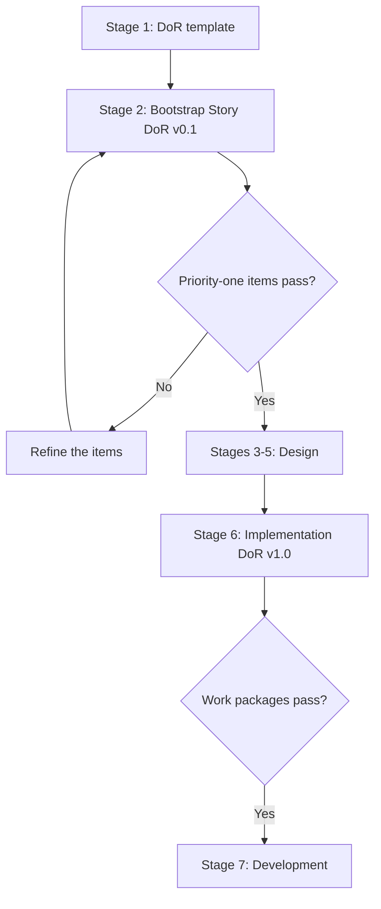

# Specification Conflict Resolution Protocol

Status: Effective on merge of `SECB-WP-FWK-019-A` (issue #36)
Authority: Operator (vily), supplied 2026-08-10
First application: `CONFLICT-FWK-019` — the DoR lifecycle circularity
Amendment: this document is `C3` under its own ladder; changes escalate

## Why this exists

A specification written by humans over time will contradict itself. When an
agent meets a contradiction it has three bad options and one good one. The bad
ones: pick a reading silently, stop and wait for a human every time, or treat
the contradiction as licence to redesign. The good one: apply a deterministic
rule, record what was found, and separate *proceeding with work* from *amending
the specification*.

That last separation is the whole point. Most conflicts of this class need a
bridge to keep working and an amendment to stop recurring, and those are
different decisions with different authorities.

## 1. Control principles

When an agent finds a specification conflict it must:

1. **Never interpret or amend the specification silently.**
2. Record both source statements **verbatim**, not paraphrased.
3. State the conflict's type and its impact.
4. Choose the resolution that changes the original intent **least**.
5. Use a provisional artifact **only** where it is reversible.
6. **Never** let a provisional decision reduce security, compliance or an
   approval gate.
7. Bind the decision to evidence and to ballots.
8. **Separate "continue working" from "amend the canonical specification."**

## 2. Conflict taxonomy

| Code | Conflict type | Example | Default action |
|---|---|---|---|
| `SC-01` | Use before definition | Stage 2 consumes an artifact created at stage 6 | Create a bootstrap artifact, or fix the dependency |
| `SC-02` | Duplicate ownership | Two stages own the same artifact | Designate the authoritative owner |
| `SC-03` | Gate mismatch | Entry and exit conditions disagree | Apply the stricter gate provisionally |
| `SC-04` | Terminology collision | One term, two meanings | Split the name and define each |
| `SC-05` | Authority conflict | An agent is told to exceed its authority | Block; send a constitutional ballot |
| `SC-06` | Evidence conflict | Documentation and test results disagree | Treat runtime evidence as data — **never auto-amend the spec from it** |
| `SC-07` | Safety or compliance conflict | A requirement would reduce a mandatory control | **Fail closed** |
| `SC-08` | Circular dependency | A requires B and B requires A | Create a bootstrap contract, or restructure |

`SC-06` deserves emphasis: a failing test proves the system disagrees with the
document, not which one is wrong. Evidence informs the amendment; it does not
make it.

## 3. Impact ladder and decision authority

| Level | Impact | What an agent may do |
|---|---|---|
| `C0` — Editorial | Naming, numbering, wording with no gate effect | Fix and record |
| `C1` — Clarification | Sharpens meaning without changing a control | Agent ballot 2/3 |
| `C2` — Reversible bridge | A provisional artifact is needed to continue | Agent ballot 3/4, with an expiry |
| `C3` — Gate semantics | Entry/exit criteria or artifact ownership change | Governance ballot **and** shadow validation |
| `C4` — Authority or safety | Reduces approval, security, quorum or a ceiling | **Constitutional authority only** |
| `C5` — Prohibited bypass | Closes a gate or removes evidence to make something pass | **Reject** |

Classification is by *effect*, not by intent or by size. A one-line edit that
moves an exit criterion is `C3`; a thousand-line document that changes no
control is `C0`.

## 4. Ballot expectations

A ballot is not a vote of agreement. Each role certifies a specific proposition:

| Role | Must prove |
|---|---|
| Requirements | The bridge artifact is sufficient to judge item quality |
| Architecture | Proceeding creates no unacceptable design debt |
| Governance | The resolution adds no authority and reduces no gate |
| QA | Criteria are measurable and gate tests exist |
| Security | No mandatory security control is deferred without tracking |

For a `C2` bridge: at least 4 of 5 approve · Governance must `APPROVE` ·
Security must not `REJECT` · every ballot binds to the exact specification
digest · the resolution carries an expiry or closing condition · the canonical
amendment opens automatically.

**Current state in this deployment: `ballot_layer.state = NOT_ACTIVE`.** Five
independent identities do not exist, and one session emitting five role-labelled
ballots is self-approval in five hats. Every quorum requirement above is
therefore unmeetable here, and the formula below resolves accordingly — by
escalating, not by waiving.

## 5. Decision formula

```text
PROCEED_WITH_PROVISIONAL_RESOLUTION =
    CONFLICT_RECORDED
AND REVERSIBLE_SOLUTION
AND NO_AUTHORITY_EXPANSION
AND NO_MANDATORY_CONTROL_REDUCTION
AND EVIDENCE_COMPLETE
AND BALLOT_QUORUM_MET
AND CANONICAL_FIX_TRACKED
```

If any conjunct fails, the status is **`SPEC_OWNER_REQUIRED`** — never a generic
`HUMAN_REQUIRED`. The distinction is operational: `SPEC_OWNER_REQUIRED` names
*who* must decide and *what* they are deciding, so the escalation arrives
actionable rather than as a request for attention.

### Vocabulary reconciliation — eight sets, deliberately separate

| Vocabulary | Question it answers | Values |
|---|---|---|
| Merge authority (`L0`, `SECB-WP-FWK-012`) | Who may land this change? | `AUTO_APPROVED` · `AUTO_APPROVED_WITH_CONDITIONS` · `AGENT_BALLOT_REQUIRED` · `CONSTITUTIONAL_REQUIRED` · `REJECTED` |
| Stage gate (`DELIVERY_LIFECYCLE.md` §2) | May the project advance? | `APPROVED` · `APPROVED_WITH_CONDITIONS` · `REWORK_REQUIRED` · `BLOCKED` · `REJECTED` · `HUMAN_REQUIRED` |
| Conflict resolution (this document) | May work proceed under a bridge? | `RESOLVED` · `PROVISIONALLY_RESOLVED` · `RESOLVED_BY_SPEC_OWNER` · `CANONICAL_RESOLVED` · `SPEC_OWNER_REQUIRED` · `REJECTED` |
| Docs–surface measurement (`BST-EL-METRIC-001`, assessed not adopted) | Is the changed surface documented? | `PASS` · `PASS_WITH_WARNING` · `FAIL_CLOSED` · `HUMAN_REQUIRED` |
| Human ballot (`DECISION_AUTHORITY.md`) | Which business outcome do we accept? | `APPROVE_OPTION_A/B/C` · `APPROVE_WITH_CONDITIONS` · `RETURN_FOR_MORE_EVIDENCE` · `DEFER_UNTIL` · `REJECT_ALL_OPTIONS` · `ABSTAIN_CONFLICT_OF_INTEREST` |
| Agent vote (`DECISION_AUTHORITY.md`, Tier 2 — not active) | Does this role support the option? | `SUPPORT` · `SUPPORT_WITH_CONDITIONS` · `OPPOSE` · `POLICY_VETO` · `ABSTAIN_INSUFFICIENT_EVIDENCE` · `ABSTAIN_OUTSIDE_COMPETENCE` |

| Baseline disposition (`TWO_PLANE_DECISION_MODEL.md` Plane A) | Is the artifact good enough? | `APPROVED` · `CHANGES_REQUIRED` · `REJECTED` |
| Obligation posture (Plane B) | What remains owed? | `CLEAR` · `OPEN_NON_BLOCKING` · `OPEN_BLOCKING` · `OPEN_UNCONTROLLED` |

The stage-gate set gains two rendered verdicts from the rendering matrix:
`HELD_FOR_CONDITION_CLOSURE` (approved baseline, blocking obligation) and
`DECISION_INCOMPLETE` (approved baseline, uncontrolled obligation).

**`SC-04` resolved, 2026-08-10:** Plane A's `CHANGES_REQUIRED` and the stage-gate
`REWORK_REQUIRED` name the same outcome at different layers — a property of the
*artifact* versus a property of the *decision*. Both are kept, scoped to their
layer, and the rendering matrix maps between them; a seventh synonym was not added.

**Eight sets now, and three tokens appear in more than one.** `REJECTED` is a
conflict verdict *and* a stage-gate verdict *and* a merge verdict *and* a Plane A
disposition — four sets, not three;
`APPROVED` is a stage-gate verdict *and* a Plane A disposition;
`HUMAN_REQUIRED` is a stage-gate verdict *and* a metric verdict, and was
deliberately **retired** from merge authority. A bare token is therefore
ambiguous: **always name the set.** Write "stage-gate `REJECTED`", never
"`REJECTED`".

They are not merged, and `SPEC_OWNER_REQUIRED` is **not** added to the merge
classifier. A conflict verdict and a merge verdict answer different questions
about different objects; collapsing them would produce a vocabulary that means
something different depending on where you read it — the defect this repository
has already fixed twice.

## 6. Conflict record requirements

Every record carries: an ID · both source statements verbatim · types and
impact level · impact analysis naming the affected gate, blocked downstream
stages, and explicit `authority_change` and `security_reduction` booleans ·
the provisional resolution with what it does **not** replace and its closing
condition · the canonical resolution and the work package tracking it · the
evidence pack · a status from the vocabulary above.

Evidence pack minimum: a dependency graph · the affected item list · a gate test
or per-item evaluation · a traceability update.

## 7. Lifecycle artifacts, not one-time documents

The DoR conflict arose because readiness was treated as a document produced
once. It is not: readiness *for design* and readiness *for coding* are different
states of the same concern, and one artifact cannot certify both.



The same shape lies waiting in at least five other artifacts, each named at one
stage and consumed at another: **Threat Model** (stage 5, consumed by stage 9's
security validation), **Test Plan** (stage 6, consumed by stage 8), **RTM**
(stage 2, appended by stages 3–8), **Release Readiness** (stage 11, consumed by
stage 12), **Production Readiness** (stage 11, consumed by stage 13). Treat each
as a lifecycle artifact with versioned levels, and the class of conflict does
not recur.

## 8. What this protocol does not authorize

- It does not permit reinterpreting a specification. Principle 1 is absolute.
- It does not permit a bridge that reduces a control (`C5` → conflict `REJECTED`).
- It does not make evidence into an amendment (`SC-06`).
- It does not lower the constitutional bar: a resolution touching authority,
  quorum, a ceiling or a trust anchor is `C4` and belongs to the constitutional
  authority alone, whatever the ballots say.
