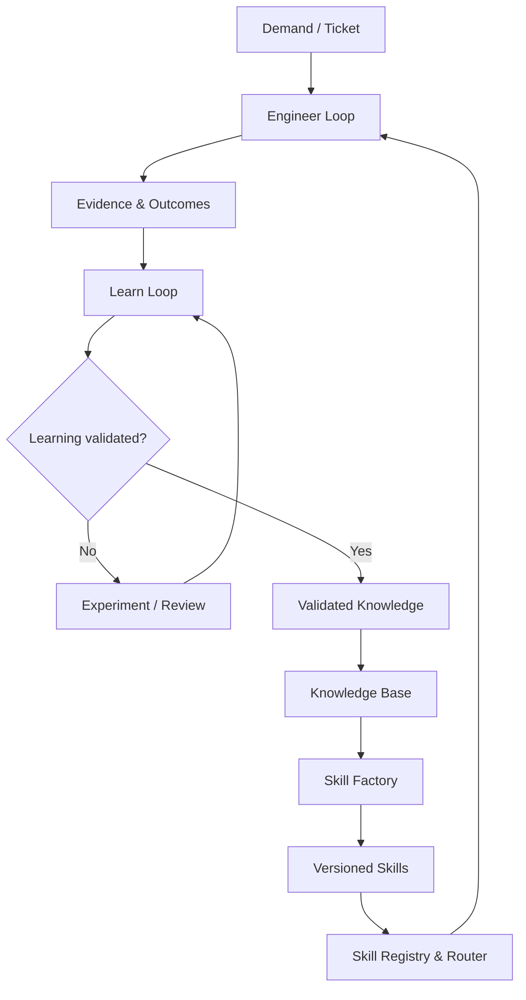

# Agentic Engineer Team — Closed-Loop Architecture

Status: Draft
Work Package: `SECB-WP-FWK-001`
Version: 0.1.0

## Purpose

Define the governed feedback architecture that converts authorized engineering demand into evidence, validated learning, organizational knowledge, and reusable skills.

## Architectural Boundaries

- The Engineer Loop may consume only authorized requirements, approved knowledge, and eligible skills.
- Raw outcomes and observations enter the Learn Loop as evidence, not as truth.
- Only validated knowledge may enter the authoritative knowledge base.
- The Skill Factory cannot directly activate a skill; approval and registry state are required.
- The router must respect authority, context, risk tier, compatibility, and lifecycle status.
- Every promotion and routing decision must be attributable and reproducible.

## Strategic Outcome

Engineering work produces evidence; evidence supports validated learning; learning becomes governed knowledge; knowledge becomes tested skills; and approved skills improve future engineering work.

