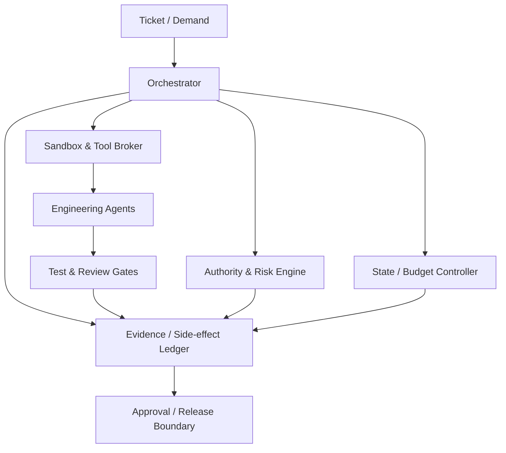

# Runtime Control Architecture

Status: Implementation Ready
Version: 1.0.0
Work Package: `SECB-WP-ENGLOOP-001`

## Architecture

## Component Contracts

| Component | Responsibility | Fail-closed dependency | Minimum API |
|---|---|---|---|
| Orchestrator | Workflow sequencing, commands, handoffs | Authority, state, budget, evidence | start, transition, checkpoint, hold, close |
| Authority & Risk Engine | Identity, scope, risk, policy and expiry decisions | Policy store, identity provider | evaluate, revalidate, revoke |
| State Controller | Optimistic concurrency and legal transitions | Durable state store | get, compare-and-transition |
| Budget Controller | Reservations, metering and breakers | Meter/event stream | reserve, consume, trip, resume |
| Sandbox Manager | Ephemeral isolated workspace lifecycle | Image registry, policy | create, attest, terminate |
| Tool Broker | Least-privilege capability mediation | Workload identity, allowlist | issue, invoke, revoke |
| Lease/Lock Service | Resource serialization with fencing | Durable consensus store | acquire, renew, release |
| Agent Runtime | Plan/implement/test/review tasks | Sandbox and tool broker | execute bounded step |
| Gate Service | Deterministic checks and reviewer decisions | CI/scanners/policy | evaluate, veto |
| Evidence Ledger | Append-only evidence, provenance and hashes | Durable object/metadata store | append, seal, verify |
| Side-effect Ledger | Idempotency and compensation | Durable transactional store | begin, commit, reconcile, compensate |
| Approval Boundary | Human/ballot decisions | Verified identities and policy | request, approve, reject, expire |
| Release Controller | Authorized reversible deployment | Release authority, telemetry | deploy, verify, rollback |

## Trust Boundaries

Agents and retrieved content are untrusted inputs. Only the control plane may grant capabilities, transition durable state, seal evidence, or accept approvals. Agents never receive standing production credentials. Tool calls cross a broker that validates episode, state, scope, risk, budget, and idempotency key.

## MVP Vertical Slice

Implement first: ticket intake, authority decision, state machine, risk/budget envelope, sandbox, one Engineer Agent, deterministic test gate, independent review record, evidence sealing, and approval request. Production deployment, autonomous merge, learning promotion, and multi-agent concurrency remain disabled.

## Non-Functional Requirements

- Durable commands are at-least-once; side effects are effectively-once through idempotency and reconciliation.
- State transition and evidence append are attributable and auditable.
- Privileged control services target high availability; their outage blocks mutation.
- All API requests carry episode, trace, actor, authority, state version, and idempotency context.
- Secrets are short-lived, task-bound, never logged, and revoked on hold or closure.
- Recovery point is the last sealed checkpoint; recovery time objectives are set during implementation planning by risk tier.

## Required ADRs Before Build Freeze

State/event store; policy engine; workload identity; sandbox runtime; evidence/object store; side-effect transaction pattern; lock/fencing implementation; observability stack; CI/security scanners; approval integration; retention and cryptographic sealing.

