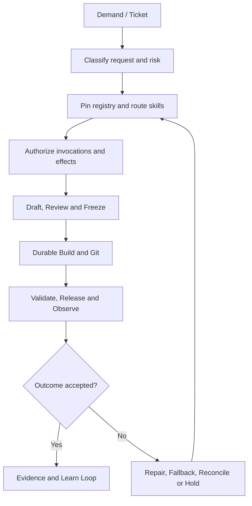

# SecB Engineer Loop — Autonomous Skill Routing Implementation-Ready Specification

Status: Full Lifecycle + Durable Execution + Autonomous Skill Routing Implementation Ready  
Version: 1.5.0  
Work Packages: `SECB-WP-ENGLOOP-001`, `SECB-WP-ENGLOOP-002`, `SECB-WP-ENGLOOP-003`, `SECB-WP-ENGLOOP-004`  
Owner: SecB Framework Owner  
Approver: Authorized project representative  
Last Updated: 2026-08-09

## 1. Purpose and decision boundary

The Engineer Loop converts authorized demand into tested, secure, traceable and reversible software, transfers sealed evidence to the Learn Loop, preserves execution state across failures, and selects the minimum sufficient qualified skills for each frozen request profile. Version 1.5.0 integrates Autonomous Skill Routing and Orchestration from the URE-Loop v1.5 source baseline.

`Implementation Ready` means the documented states, schemas, authority, evidence, recovery and tests are sufficient to begin sandbox implementation. It does not certify router software, qualify registry data, adopt the policy into runtime `AGENTS.md`, authorize plugin installation, grant credentials, approve external or mutating effects, or enable production autonomy.

## 2. Governing lifecycle

Binding sequence:

`Demand → Frozen Request Profile → Registry Snapshot → Minimum-Sufficient Route → Invocation/Effect Authorization → Draft → Review → Freeze → Build Warrant → Durable History → Branch → Code → PR → CI/Review → Merge Warrant → Merge → Tag → Build → Release Warrant → Deploy → Observe → Validate/Reconcile → Evidence → Learn → Knowledge → Skill`

## 3. Autonomous Skill Router

The router classifies intent, domain, artifact, platform, risk, required actions, side effects and validation needs. It pins the active versioned registry, filters unqualified or incompatible candidates, prioritizes explicitly named qualified skills, selects the deterministic minimum-sufficient set, resolves the prerequisite DAG, and compiles typed handoffs, validation and fallback before invocation.

Skill selection, invocation authorization and external-effect authorization are distinct decisions. Selection never creates authority. Skill output never authorizes its own use. Missing instructions, credentials, destinations, recipients, capabilities or mandatory validation fail closed or trigger the minimum necessary clarification.

Binding contracts are maintained in `skill-router/`.

## 4. Routing invariants

1. The same frozen request, registry snapshot and policy produce the same route.
2. Explicit user-selected skills receive priority only when available, qualified, compatible and authorized.
3. The selected set is minimum-sufficient; redundant skills are excluded and recorded.
4. Every selected skill version and complete instruction digest is pinned before execution.
5. Prerequisite cycles, conflicts, schema mismatches and risk-ceiling violations fail closed.
6. Typed handoffs preserve provenance, taint, data classification and authority constraints.
7. Destructive, publishing, external communication, financial and credential effects require separate confirmation or warrants under governing policy.
8. Fallbacks cannot lower safety, authority, data handling, validation or acceptance floors.
9. Unknown external outcomes are reconciled before retry or fallback.
10. Outcome learning may adjust advisory ranking only; it cannot self-admit skills or alter binding governance.

## 5. Existing lifecycle controls

The Autonomous Specification Factory, Git Controller and Durable Workflow Controller remain binding. Every routed activity executes through durable history and registered side-effect protocols. Build warrants bind frozen specification hashes; merge warrants bind exact PR head SHAs; release warrants remain separate. Protected history is never silently rewritten, and replay never repeats recorded external effects.

## 6. Validation and evidence

Required traceability:

`Requirement → Work Package → Frozen Request → Registry Snapshot → Candidate Decisions → Route Plan → Instruction Digests → Authority Receipts → Skill Executions → Typed Handoffs → Validation → Change/Test/Review → Effect Receipts → Outcome → Learning Disposition`

FIT-001–100 remain governed by their existing baselines. FIT-101–120 specify routing behavior; their presence proves design coverage only. Runtime certification requires independent, immutable execution evidence.

## 7. Governance posture

| Scope | Status |
|---|---|
| v1.5 documentation integration | `APPROVED` |
| Skill Router design | `IMPLEMENTATION_READY_SPECIFICATION` |
| Full documented Engineer Loop | `FULL_LIFECYCLE_IMPLEMENTATION_READY` |
| Registry and compatibility data | `NOT_IMPLEMENTED / NOT_EVIDENCED` |
| Router and orchestrator software | `NOT_IMPLEMENTED / NOT_EVIDENCED` |
| Runtime `AGENTS.md` adoption | `NOT_AUTHORIZED` |
| FIT-101–120 certification | `PENDING` |
| External or mutating routing | `NOT_AUTHORIZED` |
| Production autonomy | `NOT_AUTHORIZED` |

Next governed transition: `IMPLEMENTATION_READY → SANDBOX_TESTED` through separately authorized implementation work packages, beginning with taxonomy and registry work. A separately authorized R0 read-only pilot is required before any mutating or external-effect routing.

## 8. Change history

| Version | Date | Change | Authority |
|---|---|---|---|
| 0.1.0 | 2026-08-08 | Initial Engineer Loop skeleton | `SECB-WP-FWK-001` |
| 1.0.0 | 2026-08-08 | Integrated verified URE-Loop design | `SECB-WP-FWK-001` |
| 1.1.0 | 2026-08-08 | Added core implementation contracts | `SECB-WP-ENGLOOP-001` |
| 1.2.0 | 2026-08-08 | Added Specification Factory and Git Controller | `SECB-WP-ENGLOOP-002` |
| 1.3.0 | 2026-08-09 | Added durable history, replay, reconciliation and compensation | `SECB-WP-ENGLOOP-003` |
| 1.5.0 | 2026-08-09 | Added autonomous minimum-sufficient skill routing and orchestration | `SECB-WP-ENGLOOP-004`; `AUTH-URE-SKILL-ROUTER-20260809-001` |
