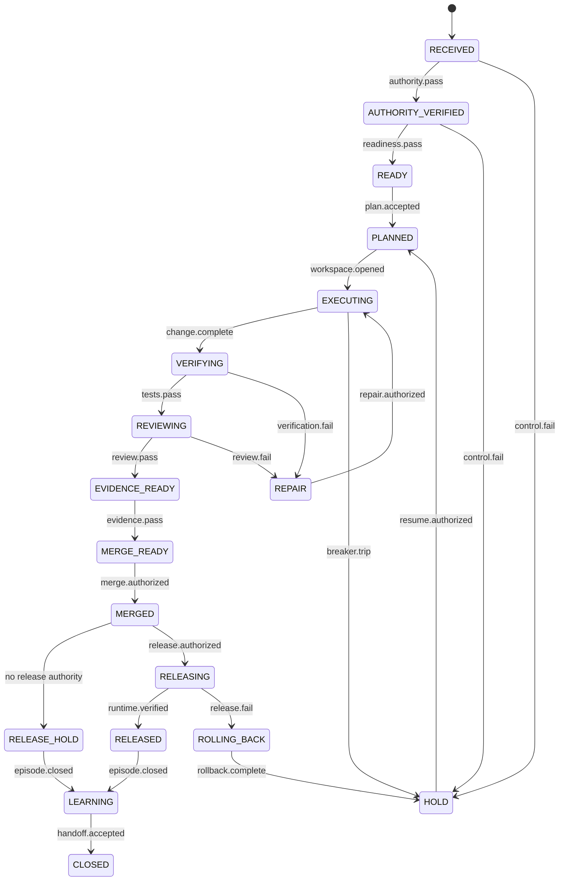

# Engineer Loop State Machine

Status: Implementation Ready
Version: 1.0.0
Work Package: `SECB-WP-ENGLOOP-001`

## State Model

## Canonical States

| State | Entry condition | Permitted mutation | Required exit evidence |
|---|---|---|---|
| `RECEIVED` | Ticket recorded | Metadata only | Intake record |
| `AUTHORITY_VERIFIED` | Identity, authority, scope, expiry valid | None | Authority decision |
| `READY` | Requirements and acceptance criteria sufficient | None | Readiness decision |
| `PLANNED` | Plan, risk, tests, evidence, rollback and budget approved | Workspace reservation | Plan package |
| `EXECUTING` | Sandbox, lease, identity and checkpoint active | Scoped implementation | Change and side-effect log |
| `VERIFYING` | Candidate change frozen for checks | Test-only mutation | Test/scan results |
| `REVIEWING` | Deterministic gates passed | Review metadata | Independent review decision |
| `EVIDENCE_READY` | Review passed | Evidence assembly | Signed manifest |
| `MERGE_READY` | Evidence Gate passed | None | Merge eligibility decision |
| `MERGED` | Separate merge authority effective | Repository merge | Merge ID and resulting SHA |
| `RELEASE_HOLD` | No effective release authority | None | Hold reason |
| `RELEASING` | Release Gate passed | Authorized environment mutation | Deployment telemetry |
| `RELEASED` | Runtime verification passed | Observed-state reconciliation | Release verification |
| `LEARNING` | Episode evidence sealed | Learning records only | Learn Loop intake |
| `REPAIR` | Recoverable gate failure | Authorized bounded repair | Repair plan and new budget |
| `ROLLING_BACK` | Release failure or abort | Compensating action | Rollback verification |
| `HOLD` | Any fail-closed condition | No engineering mutation | Blocker and safe-state record |
| `CLOSED` | Handoff complete | None | Closure decision |

## Transition Contract

Every transition command contains `transition_id`, `episode_id`, `from_state`, `to_state`, `actor_id`, `authority_ref`, `expected_version`, `idempotency_key`, `guard_results`, `evidence_refs`, `occurred_at`, and `reason`.

The state store must reject transitions when the current version differs from `expected_version`, the authority is expired, a guard is not `PASS`, evidence cannot be verified, or the transition is absent from the approved table.

## Recovery Rules

- Checkpoints are valid only when repository SHA, policy version, schema version, authority, lease, and side-effect ledger reconcile.
- A restart resumes from the last verified checkpoint, never from an unverified agent narrative.
- `HOLD` is the default destination for ambiguity, budget exhaustion, control-plane outage, scope drift, or integrity mismatch.
- `REPAIR` requires a bounded repair plan and refreshed budget; it cannot silently expand scope.
- Production failure enters `ROLLING_BACK`; rollback failure remains `HOLD` and requires incident authority.

