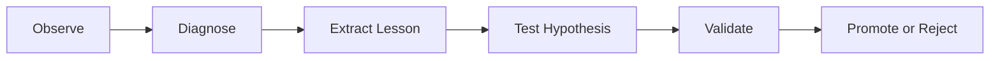

# Learn Loop — Convert Experience into Insight

Status: Draft
Work Package: `SECB-WP-FWK-001`

## Purpose

Identify reusable lessons from successful and unsuccessful engineering episodes without converting unverified observations into operational truth.

## Evaluation Questions

- What worked, and under which conditions?
- What failed, and what was the root cause?
- Which steps created rework, delay, risk, or excessive cost?
- Was a skill missing, outdated, unsafe, or incorrectly routed?
- Can the lesson be generalized safely?
- What evidence supports or challenges the conclusion?

## Outcome Classification

| Outcome | Treatment |
|---|---|
| Project-specific fact | Store as project knowledge |
| Reusable engineering pattern | Propose for organizational knowledge |
| Repeatable procedure | Create a skill candidate |
| Policy or control lesson | Propose a governance update |
| Unverified observation | Retain as a hypothesis |
| Incorrect or unsafe approach | Record as an anti-pattern |

## Promotion Condition

Promotion requires traceable evidence, defined applicability boundaries, conflict checks, an accountable owner, independent validation, and approval appropriate to impact.

