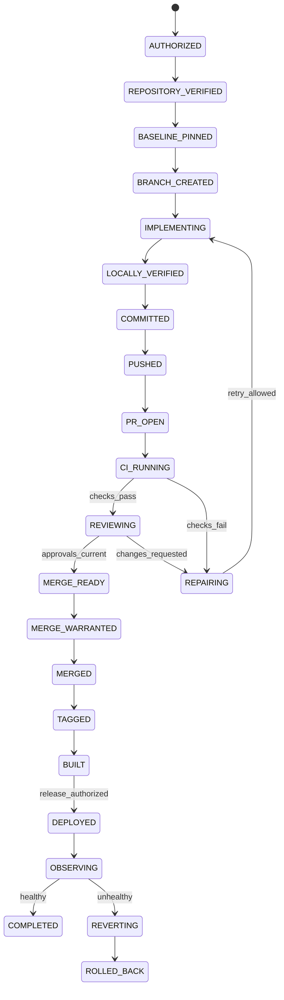

# Autonomous Git State Machine

Status: Implementation Ready | Version: 1.0.0 | Work Package: `SECB-WP-ENGLOOP-002`

## Universal transition envelope

Every transition supplies operation ID, idempotency key, expected state version, actor/workload identity, authority/warrant ID, repository ID, expected base/head SHA, precondition results, evidence references, timeout, retry limit and failure transition. The State Controller performs compare-and-swap; the Side-effect Ledger reconciles uncertain outcomes before retry.

## Mandatory guards

- Repository identity and remotes match allowlist.
- Worktree status matches policy and baseline SHA remains reachable.
- Branch is owned, unexpired and not protected.
- Commit tree contains only authorized paths and no detected secrets.
- PR head/base SHAs match recorded values.
- Required CI, security and review contexts are successful and current for the exact head SHA.
- Merge queue rechecks expected head and base immediately before protected merge.
- Release authorization is distinct, unexpired and artifact-digest bound.

Conflict, outage, integrity mismatch, stale approval, budget exhaustion or unknown side-effect result transitions to `HELD` or `OUTAGE_PRESERVED` until reconciliation.
