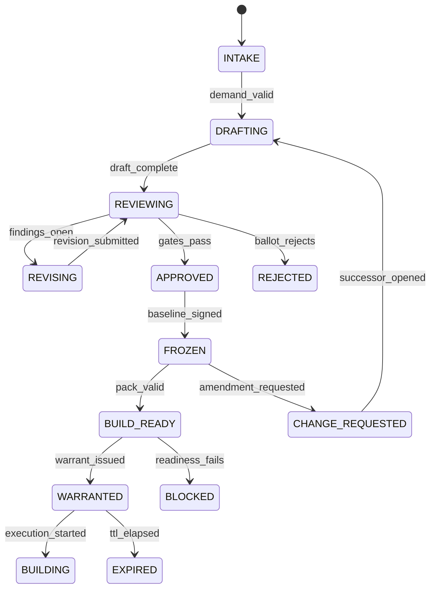

# Specification State Machine Contract

Status: Implementation Ready | Version: 1.0.0 | Work Package: `SECB-WP-ENGLOOP-002`

## Transition contract

| From → To | Authorized actor | Required guard | Required evidence | Failure state |
|---|---|---|---|---|
| `INTAKE → DRAFTING` | Orchestrator | Ticket, authority and scope valid | Intake manifest; authority warrant | `BLOCKED` |
| `DRAFTING → REVIEWING` | Requirements Agent | Mandatory sections and RTM complete | Draft hash; validation report | `DRAFTING` |
| `REVIEWING → REVISING` | Review coordinator | Actionable findings exist | Signed finding set | `HELD` |
| `REVISING → REVIEWING` | Requirements Agent | All responses mapped to findings | Revision diff; response matrix | `REVISING` |
| `REVIEWING → APPROVED` | Governance Agent | Reviews pass; ballot quorum; no veto | Review reports; ballot result; closed conditions | `REJECTED`/`HELD` |
| `APPROVED → FROZEN` | Baseline custodian | Canonicalization succeeds; signature authority valid | Manifest, signature, SHA-256 | `HELD` |
| `FROZEN → BUILD_READY` | Readiness assessor | Implementation pack, tests, risks and rollback complete | Readiness certificate | `BLOCKED` |
| `BUILD_READY → WARRANTED` | Authority Engine | Certificate current; budget/scope/TTL valid | Implementation warrant | `HELD` |
| `WARRANTED → BUILDING` | Engineer Orchestrator | Warrant unexpired; baseline hash exact | Start event with idempotency key | `EXPIRED`/`HELD` |

All mutations require `expected_state_version`, `idempotency_key`, actor workload identity, timestamp, and append-only transition event. Conflicting versions fail closed. Terminal records are `REJECTED`, `SUPERSEDED`, and completed handoff to the Engineer Loop.
