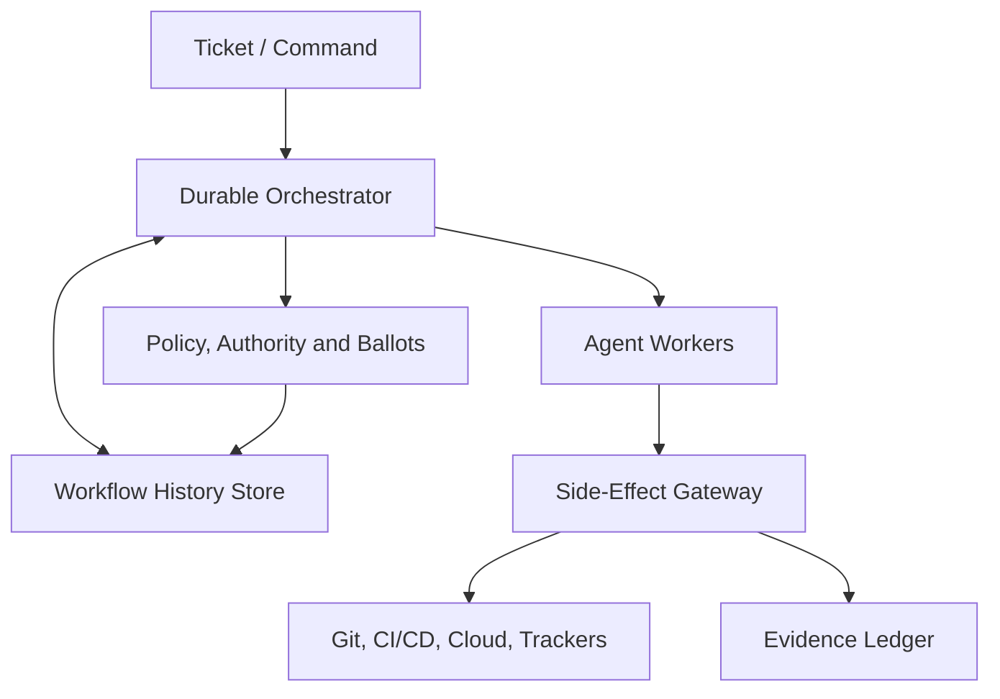
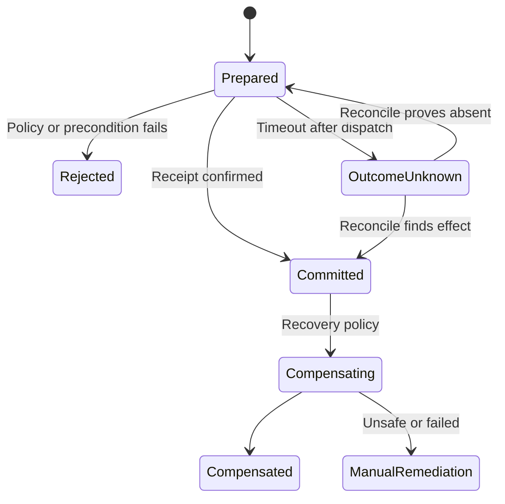
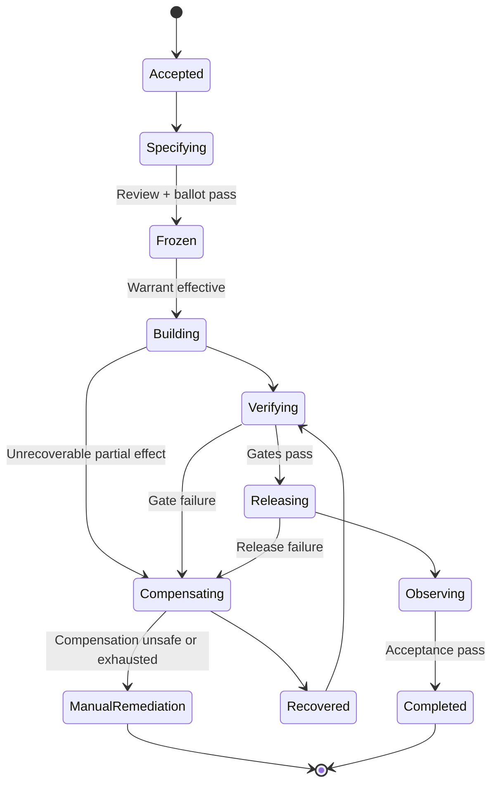

# Agentic Engineer Team — Durable Workflow History, Replay and Compensation

**Document ID:** BST-AET-DWRC-001  
**Version:** 1.0  
**Status:** PROPOSED → IMPLEMENTATION_READY  
**Owner:** Agentic Engineering Governance  
**Applies to:** Engineer Loop, autonomous Git cycle, CI/CD, release, rollback, learning and ballot governance  
**Control principle:** No Ticket, No Work; No Warrant, No Side Effect; No Evidence, No Completion

---

## 1. Executive decision

The Agentic Engineer Team shall execute every material work item as a **durable, event-sourced workflow**. A workflow may stop, restart, migrate between workers, replay its decision history, and compensate completed side effects without losing its control state or evidence chain.

The design establishes three independent mechanisms:

1. **Durable history** records every accepted command, decision, state transition, ballot, tool invocation, side-effect receipt and evidence reference in an append-only ledger.
2. **Replay** reconstructs workflow state from recorded history. It must not repeat external side effects.
3. **Compensation** executes a separately authorized business reversal or remediation when an already-completed external action cannot be atomically rolled back.

This capability upgrades the Engineer Loop from a sequence of agent prompts into a recoverable production control plane.

## 2. Target outcomes

| Outcome | Acceptance measure |
| --- | --- |
| Survive process, node and agent failure | Workflow resumes from durable history without duplicating committed effects |
| Reproduce a decision | Same workflow code, inputs, policy bundle and model/tool versions reconstruct the same logical state |
| Correct partial execution | Every compensable side effect has a registered compensation handler and receipt |
| Preserve autonomous authority | Each side effect is bound to a valid ticket, work package and authority warrant |
| Enable governance audit | Full causal chain is queryable from demand through release, compensation and closure |
| Contain runaway loops | Retry, time, cost and step budgets are enforced durably across restarts |
| Support safe upgrades | In-flight workflows use version pinning, patching or an approved migration strategy |

## 3. Scope

### 3.1 Included

- Ticket-to-specification and Draft-to-Build workflows
- Architecture and risk ballots
- Branch, commit, pull request, review, merge and tag lifecycle
- Build, test, security scan, deployment, verification and rollback
- Multi-agent task assignment, lease renewal and reassignment
- Durable timers, retry policies, human/agent signals and external callbacks
- Replay, forensic replay, simulation replay and workflow reset
- Compensation, forward recovery and manual remediation
- Evidence, knowledge and learning-event publication

### 3.2 Excluded from automatic compensation

- Deletion or irreversible mutation without a validated recovery method
- Credential rotation unless explicitly authorized by a security playbook
- Legal, financial or regulatory acceptance decisions
- Production data repair without a scoped data-change warrant
- Any operation for which the workflow cannot prove target identity and expected precondition

These operations enter `PAUSED_REQUIRES_AUTHORITY` or `MANUAL_REMEDIATION` rather than being guessed by an agent.

## 4. Architectural model



### 4.1 Components

| Component | Responsibility | Prohibited behavior |
| --- | --- | --- |
| Durable Orchestrator | Own workflow state, scheduling, durable timers, retries and recovery | Directly perform external effects |
| Workflow History Store | Append ordered events with optimistic concurrency and integrity protection | Update or delete accepted history |
| Agent Worker | Plan, analyze, generate artifacts and return declared commands/results | Treat local memory as authoritative state |
| Side-Effect Gateway | Enforce warrant, idempotency, preconditions, execution and receipt capture | Execute unregistered or unscoped effects |
| Authority Engine | Evaluate ticket, risk, role, segregation-of-duties and warrant scope | Grant authority based only on agent assertion |
| Ballot Service | Produce durable collective decisions for designated gates | Reopen a closed ballot without a superseding ballot |
| Evidence Ledger | Store hashes and references to test, scan, review and deployment evidence | Substitute evidence with narrative claims |
| Snapshot Store | Accelerate recovery using verified state snapshots | Replace canonical event history |
| Compensation Registry | Map effect types and versions to safe compensation definitions | Invent compensation at failure time |
| Dead-Letter / Intervention Queue | Hold poison events and unresolved remediation cases | Silently discard failed work |

## 5. Workflow identity and hierarchy

Every execution object has a stable identity:

| Object | Example | Purpose |
| --- | --- | --- |
| Program | `BST` | Portfolio boundary |
| Project | `SECB` | Governance and data boundary |
| Ticket | `SEC-842` | Authorized demand |
| Work Package | `WP-SEC-842-01` | Executable scope and acceptance contract |
| Workflow | `WF-01J...` | One durable orchestration instance |
| Run | `RUN-01J...-0003` | One execution attempt of the workflow |
| Step | `STEP-BUILD-004` | Deterministic unit of orchestration |
| Effect | `EFF-GIT-019` | External side-effect request |
| Compensation | `COMP-GIT-019` | Reversal/remediation for an effect |

Required correlation fields are `tenant_id`, `project_id`, `ticket_id`, `work_package_id`, `workflow_id`, `run_id`, `causation_id`, `correlation_id`, `policy_bundle_hash` and `authority_warrant_id`.

## 6. Durable history model

### 6.1 Event envelope

```yaml
event_id: evt_01J...
workflow_id: wf_01J...
run_id: run_01J..._0003
sequence: 184
event_type: SideEffectCommitted
event_version: 1
occurred_at: 2026-08-08T15:45:22.198Z
recorded_at: 2026-08-08T15:45:22.241Z
tenant_id: bst
project_id: secb
ticket_id: SEC-842
work_package_id: WP-SEC-842-01
step_id: STEP-PR-CREATE-001
causation_id: cmd_01J...
correlation_id: corr_SEC-842
actor:
  type: agent
  id: release-agent
  runtime_instance: worker-17
authority:
  warrant_id: aw_01J...
  warrant_hash: sha256:...
  policy_bundle_hash: sha256:...
payload_ref: blob://sha256/...
payload_hash: sha256:...
previous_event_hash: sha256:...
event_hash: sha256:...
classification: INTERNAL
retention_class: ENGINEERING_7Y
```

Large payloads are stored in an immutable object store; history contains the content hash, media type, size, encryption key reference and durable locator. Secrets, raw tokens and unrestricted personal data must never be written to history.

### 6.2 Mandatory event families

| Family | Minimum event types |
| --- | --- |
| Lifecycle | `WorkflowCreated`, `WorkflowStarted`, `WorkflowPaused`, `WorkflowCompleted`, `WorkflowFailed`, `WorkflowTerminated` |
| Specification | `DraftCreated`, `ReviewRequested`, `ReviewFindingRaised`, `SpecificationFrozen`, `ImplementationAuthorized` |
| Agent | `TaskScheduled`, `TaskLeased`, `LeaseRenewed`, `AgentResultRecorded`, `TaskTimedOut` |
| Decision | `DecisionRequested`, `PolicyEvaluated`, `BallotOpened`, `VoteRecorded`, `BallotClosed`, `DecisionEffective` |
| Effect | `SideEffectPrepared`, `SideEffectCommitted`, `SideEffectRejected`, `SideEffectOutcomeUnknown` |
| Retry | `AttemptFailed`, `RetryScheduled`, `RetryBudgetExhausted` |
| Git | `BranchCreated`, `CommitRecorded`, `PullRequestOpened`, `ReviewRecorded`, `MergeCommitted`, `TagCreated` |
| Delivery | `BuildCompleted`, `TestsCompleted`, `ScanCompleted`, `DeploymentStarted`, `DeploymentVerified`, `RollbackCompleted` |
| Compensation | `CompensationPlanned`, `CompensationAuthorized`, `CompensationStarted`, `CompensationCompleted`, `CompensationFailed` |
| Evidence | `EvidenceRegistered`, `EvidenceSuperseded`, `AcceptanceEvaluated` |
| Upgrade | `WorkflowPatched`, `WorkflowMigrated`, `ReplayVerified` |

### 6.3 Ordering and consistency

- Events are strictly ordered within one workflow by `sequence`.
- Append uses compare-and-swap against the expected last sequence.
- Cross-workflow consistency is achieved with messages, correlation identifiers and reconciliation—not a distributed transaction.
- Inbox deduplication prevents duplicate inbound commands.
- Transactional outbox publication ensures an accepted history event is eventually delivered to subscribers.
- Hash chaining detects missing, reordered or modified records.
- A daily signed checkpoint anchors workflow partitions in the Evidence Ledger.

### 6.4 Snapshot policy

Snapshots are performance aids, not evidence replacements.

- Create after 250 events, 10 MB of replay payload, a completed stage gate or before workflow migration.
- Include workflow state, last sequence, workflow definition version, policy hash, state schema version and snapshot hash.
- Verify the snapshot hash before use.
- Replay all later events after loading a snapshot.
- Retain enough historical snapshots to test migrations and corruption recovery.

## 7. Deterministic workflow contract

Workflow orchestration code must be deterministic. It may:

- Read recorded events and deterministic configuration pinned in history.
- Schedule activities, timers, ballots and child workflows.
- Produce commands whose parameters derive from recorded state.

It must not directly:

- Read wall-clock time; use a recorded workflow clock.
- Generate random identifiers; obtain and record them through an activity.
- Call a model, Git provider, CI system, database or network service.
- Read mutable environment variables or an unpinned policy bundle.
- Depend on unordered iteration or machine-local files.

LLM inference is always an activity. Record the model/provider identifier, prompt-template hash, input hash, tool schema version, decoding configuration, output hash, safety/policy result, token/cost metrics and evidence locator. Replay consumes the recorded result and does not call the model again.

## 8. Replay design

### 8.1 Replay modes

| Mode | Executes effects? | Purpose | Authority |
| --- | ---: | --- | --- |
| Recovery replay | No | Rebuild state after worker/orchestrator failure | Automatic |
| Verification replay | No | Detect nondeterminism after code change | CI gate |
| Forensic replay | No | Explain decision and reconstruct incident timeline | Auditor warrant |
| Simulation replay | Sandbox only | Test alternative policy/model outputs from a forked history | Experiment warrant |
| Reset-and-replay | Only new commands after reset point | Re-run selected workflow logic from a safe event boundary | Change ballot + warrant |

### 8.2 Replay algorithm

1. Resolve the workflow definition and state schema versions recorded at workflow creation.
2. Load the latest valid compatible snapshot, if available.
3. Stream subsequent events in sequence order and verify hashes.
4. Run deterministic workflow code against each recorded result.
5. Compare newly produced orchestration commands with commands already in history.
6. If equivalent, advance without executing external activity.
7. If different, emit `NondeterminismDetected`, stop and route to migration or patch governance.
8. At the history frontier, resume scheduling only if the workflow retains valid authority and budgets.

### 8.3 Replay safety invariants

- An event is applied at most once to in-memory state per replay pass.
- A replayed activity result never re-invokes its tool.
- A committed effect is identified by durable `effect_id` and idempotency key, not step position alone.
- Reset cannot erase history; it creates a new branch with `forked_from_event_id`.
- Simulation output cannot enter production evidence or control state without a new authorization decision.
- Authority is revalidated at the history frontier before new side effects, but past decisions remain historically intact.

### 8.4 Workflow code evolution

| Change type | Treatment |
| --- | --- |
| Add a future step | Guard with a durable version marker |
| Rename/refactor without semantic change | Replay test against captured histories |
| Change decision logic | Pin old workflow version or record an explicit patch marker |
| Change state schema | Versioned snapshot/event upcaster plus migration tests |
| Remove a step that may exist in history | Retain compatibility handler until all affected workflows close |
| Emergency defect | Approved workflow patch with scope, expiry, evidence and rollback |

Deployment is blocked unless the new worker passes a replay corpus containing normal, retry, timeout, ballot, compensation and long-running histories.

## 9. Side-effect execution protocol

Every external mutation uses a **prepare–commit–reconcile** protocol:



### 9.1 Effect request contract

Each effect request must declare:

- Stable `effect_id` and provider-scoped idempotency key
- Exact target resource identity
- Desired mutation and expected precondition/version
- Authority warrant and expiry
- Risk class and data classification
- Timeout, retry policy and reconciliation query
- Success receipt schema
- Compensation type, handler version and deadline
- Evidence requirements

### 9.2 Outcome-unknown rule

A network timeout after dispatch is not a failure; it is `OUTCOME_UNKNOWN`. The gateway must query the provider using the idempotency key, target version or receipt reference before retrying. Blind retries are prohibited.

### 9.3 Idempotency hierarchy

1. Use provider-native idempotency tokens where available.
2. Use create-if-absent or compare-and-swap preconditions.
3. Use a gateway effect journal and reconciliation lookup.
4. If none is possible, classify the action as non-idempotent and require stronger authority or manual execution.

## 10. Compensation model

Compensation is a new governed action, not deletion of the original action. The original event and receipt remain immutable.

### 10.1 Compensation categories

| Category | Example | Preferred response |
| --- | --- | --- |
| Semantic inverse | Remove an unmerged branch created by the workflow | Execute registered inverse after verifying ownership and SHA |
| Version restoration | Deployment introduced regression | Redeploy last verified artifact; do not rebuild from source |
| Forward correction | Published package cannot be deleted safely | Publish corrected version and deprecate prior version |
| Administrative remediation | PR notification sent to wrong channel | Post correction and update record |
| Irreversible effect | Secret exposed or external irreversible publication | Contain, rotate/revoke where authorized, preserve evidence, escalate |

### 10.2 Compensation contract

```yaml
compensation_type: RestoreDeployment
version: 2
applies_to_effect: DeployArtifact
trigger_policy:
  automatic_when: verification_gate_failed
  ballot_required_when: data_migration_executed
preconditions:
  - prior_artifact_is_verified
  - deployment_target_matches_receipt
action:
  handler: deployment.restore_verified_artifact
  timeout: PT15M
retry:
  maximum_attempts: 3
  backoff: exponential
postconditions:
  - health_gate_passed
  - traffic_state_confirmed
evidence:
  - deployment_receipt
  - health_report
  - incident_timeline
fallback: MANUAL_REMEDIATION
```

### 10.3 Compensation ordering

- Default to reverse causal order for dependent effects.
- Independent compensation branches may run in parallel only when resource scopes do not overlap.
- Revalidate current resource state before every compensation; never assume it is unchanged.
- Do not compensate an effect owned or modified by another workflow without a conflict ballot.
- A failed compensation is retried only within its declared safety window and budget.
- Exhaustion enters `MANUAL_REMEDIATION` and freezes downstream release activity.

### 10.4 Git and delivery compensation matrix

| Completed effect | Safe compensation | Guard conditions |
| --- | --- | --- |
| Branch created | Delete branch | Workflow owns branch; no foreign commits; not protected |
| Commit pushed | Revert commit with new commit | Target SHA verified; branch protection respected |
| PR opened | Close PR and label compensated | No merge occurred; explanation and evidence linked |
| PR merged | Create revert PR | New ballot/review; never rewrite protected history |
| Tag created | Deprecate or delete according to release policy | Artifact publication state checked |
| Artifact published | Deprecate and publish corrected version | Registry immutability and consumer impact checked |
| Deployment completed | Redeploy last verified immutable artifact | Compatibility and data migration state verified |
| Feature enabled | Disable via versioned flag change | Kill-switch authority and tenant scope verified |
| Database migration applied | Forward-fix or tested down migration | Data-loss analysis and data-change warrant required |

## 11. End-to-end workflow state machine



Any active state may transition to `PAUSED_BUDGET`, `PAUSED_AUTHORITY`, `PAUSED_POLICY`, `PAUSED_DEPENDENCY` or `TERMINATED`. Resume is an explicit recorded transition.

## 12. Agent team responsibilities

| Role | Primary responsibility | Segregation rule |
| --- | --- | --- |
| Orchestrator Agent | Advance durable workflow and schedule tasks | Cannot approve its own exception |
| Specification Agent | Build and refine executable specification | Cannot freeze a high-risk specification alone |
| Architecture Agent | ADRs, dependency and migration analysis | Vote is separate from implementation vote |
| Engineer Agent | Implement work package and unit tests | Cannot self-accept production release |
| Review Agent | Review code, contracts and traceability | Must use independent context for designated risks |
| QA Agent | Test plan, execution and evidence | Cannot alter code under the same task identity |
| Security Agent | Threat, dependency, secret and policy checks | Holds security veto for critical findings |
| Release Agent | Execute authorized delivery activities | Cannot bypass verification gates |
| Recovery Agent | Diagnose and propose replay/compensation plan | Compensation execution requires its own warrant |
| Evidence Auditor | Validate completeness and hashes | Read-only over operational systems |
| Learning Agent | Extract reusable patterns from closed histories | Cannot modify the source history |

## 13. Ballot and authority integration

### 13.1 Required ballots

- Specification freeze for high-risk or cross-domain changes
- Implementation authorization when the frozen baseline is effective
- Destructive or non-idempotent side effect
- Reset-and-replay beyond a non-effect boundary
- Compensation affecting shared production resources
- Workflow migration with changed business semantics
- Acceptance of unresolved critical evidence gaps

### 13.2 Authority warrant claims

A warrant must bind subject, ticket, work package, allowed effect types, resource scope, environment, maximum risk, cost ceiling, validity period, required evidence, compensation permission and policy hash. The Side-Effect Gateway rejects effects outside any claim and records the rejection.

Authority expires durably. Restarting or replaying a workflow never extends it.

## 14. Failure taxonomy and response

| Failure class | Example | Automatic response |
| --- | --- | --- |
| Transient activity | Rate limit, temporary unavailable | Durable retry with bounded backoff and jitter |
| Worker loss | Lease expires | Reassign task; deduplicate result/effect |
| Orchestrator restart | Process/node failure | Recovery replay from snapshot + history |
| Determinism violation | New code schedules different command | Stop; patch, migrate or retain old worker |
| Outcome unknown | Timeout after mutation dispatch | Reconcile before retry |
| Business rejection | Review or gate fails | Route to correction or compensation policy |
| Authority failure | Warrant expired or scope mismatch | Pause and request new decision |
| Budget exhaustion | Token, cost, retry or elapsed-time limit | Pause; emit budget evidence; ballot if extension needed |
| Poison event | Cannot deserialize/apply | Quarantine; preserve offset; migration intervention |
| Compensation failure | Inverse unsafe or exhausted | Manual remediation; freeze dependent workflows |
| Ledger integrity failure | Hash/sequence mismatch | Fail closed; isolate partition; incident process |

## 15. Durable budgets and circuit breakers

Budgets survive restart and replay. Minimum counters are total workflow steps, activity attempts, model tokens, model/tool cost, wall-clock duration, concurrent tasks, compensation attempts and external mutations.

Circuit breakers operate per provider, repository, environment and workflow. Their state is recorded so a restart cannot reset failure counts. Half-open probes are read-only or use a designated safe synthetic operation.

## 16. Storage and data model baseline

Minimum logical tables/streams:

- `workflow_instance`
- `workflow_event`
- `workflow_snapshot`
- `activity_task`
- `activity_lease`
- `inbox_message`
- `outbox_message`
- `effect_journal`
- `compensation_instance`
- `durable_timer`
- `authority_warrant_ref`
- `ballot_ref`
- `evidence_ref`
- `workflow_definition`
- `workflow_patch`
- `replay_verification_result`

Partition events by tenant and workflow hash; index by workflow/sequence, ticket, work package, event type, correlation ID, effect ID and time. Encrypt payloads at rest and separate sensitive payload storage from searchable metadata.

## 17. Observability and audit

### 17.1 Required operational indicators

| Indicator | Target / alert concept |
| --- | --- |
| Workflow recovery time | p95 from worker loss to resumed scheduling |
| Replay throughput | Events reconstructed per second by history size class |
| Nondeterminism rate | Zero in release replay corpus |
| Duplicate-effect rate | Zero committed duplicates |
| Outcome-unknown age | Alert by effect risk class |
| Compensation success | Percentage completed within recovery objective |
| Manual-remediation backlog | Count and maximum age |
| History append latency | p50/p95/p99 |
| Evidence completeness | 100% for required gate evidence |
| Budget-trip rate | By agent, model, tool, repository and workflow type |

### 17.2 Explainability query

For any final result, the system must answer:

> Which ticket authorized this work, which frozen specification and policy version governed it, which agents and tools acted, what evidence supported each gate, what external effects occurred, and whether any effect was retried, reconciled or compensated?

## 18. Security and integrity controls

- Tenant/project isolation on every history and payload access.
- Append-only writer role separated from retention administration.
- Encryption at rest and in transit; payload-level encryption for sensitive evidence.
- Secret detection and redaction before history append.
- Signed effect receipts where the provider supports them.
- Hash chain plus periodic external checkpoint.
- Least-privilege, short-lived credentials obtained only by the Side-Effect Gateway.
- Policy-as-code evaluation before task assignment and before effect commit.
- Egress allowlists and tool-schema validation.
- Immutable audit of read access for restricted histories.
- Legal hold and retention schedules by project/data class.

## 19. Recovery objectives

Initial service objectives:

| Class | Example | RPO | RTO |
| --- | --- | ---: | ---: |
| Control history | Events, ballots, warrants, effects | 0 accepted events | 15 minutes |
| Evidence metadata | Hashes and locators | 0 committed references | 30 minutes |
| Large evidence payload | Logs, reports, artifacts | ≤5 minutes where replicated | 4 hours |
| Analytics/read models | Dashboards and search projections | Rebuildable | 8 hours |

The production design must use quorum/replicated storage appropriate to these objectives and regularly prove restore and replay from backup.

## 20. Implementation interfaces

```text
POST /workflows
POST /workflows/{id}/signals
POST /workflows/{id}/pause
POST /workflows/{id}/resume
POST /workflows/{id}/terminate
POST /workflows/{id}/replay-verifications
POST /workflows/{id}/resets
GET  /workflows/{id}/history
GET  /workflows/{id}/state
POST /effects/prepare
POST /effects/{id}/commit
POST /effects/{id}/reconcile
POST /effects/{id}/compensations
GET  /effects/{id}/receipt
```

All mutations require idempotency keys, actor identity, ticket/work-package references, warrant reference and expected resource version where applicable.

## 21. Acceptance tests

The capability is not production-ready until all scenarios pass:

1. Kill a worker before activity execution; task is reassigned once.
2. Kill a worker after external commit but before result acknowledgement; reconciliation prevents duplicate effect.
3. Restart the orchestrator during a durable timer; timer fires once at or after its deadline.
4. Replay a completed workflow; no model, tool or external API is invoked.
5. Deploy incompatible workflow code; nondeterminism is detected and scheduling stops.
6. Replay from a verified snapshot and from event zero; final state hashes match.
7. Expire a warrant during a pause; replay succeeds but new effects remain blocked.
8. Exhaust retry and cost budgets; restart does not reset counters.
9. Fail a release verification; registered deployment compensation restores the prior artifact.
10. Modify a resource externally before compensation; precondition failure prevents unsafe reversal.
11. Corrupt or remove a history event in a test replica; integrity verification fails closed.
12. Simulate outbox delivery duplication; downstream consumer applies the message once.
13. Fail compensation repeatedly; case enters manual remediation and freezes dependencies.
14. Migrate a state schema; old histories replay identically through versioned upcasters.
15. Produce the full ticket-to-effect-to-evidence audit chain from a single correlation query.

## 22. Phased delivery roadmap

| Phase | Scope | Exit gate |
| --- | --- | --- |
| P0 — Contract freeze | Event envelope, workflow/effect IDs, determinism rules, authority claims, compensation registry schema | Architecture and governance ballots pass |
| P1 — Durable kernel | History append, snapshots, tasks, leases, timers, inbox/outbox, recovery replay | Failure tests 1–4 and 12 pass |
| P2 — Effect safety | Side-Effect Gateway, idempotency, receipts, reconciliation, Git adapters | Tests 2, 7, 8 and 10 pass |
| P3 — Compensation | Compensation planner/registry, deployment and Git compensation handlers | Tests 9 and 13 pass |
| P4 — Upgrade safety | Replay corpus, nondeterminism detection, patches, state migration | Tests 5, 6 and 14 pass |
| P5 — Production hardening | HA/DR, integrity checkpoints, observability, retention, performance | All tests pass; RPO/RTO exercise evidenced |

## 23. Definition of Ready

- Workflow and state schema are versioned.
- Ticket, Work Package Contract and acceptance criteria are effective.
- Risk class and authority path are determined.
- Every planned side effect declares idempotency, reconciliation and compensation behavior.
- Required ballots and segregation-of-duties are configured.
- Step, retry, time and cost budgets are set.
- Evidence requirements and retention class are known.
- Workflow history passes deterministic replay tests.

## 24. Definition of Done

- Final workflow state is terminal and internally consistent.
- Every prepared effect is committed, rejected, proven absent, compensated or assigned to manual remediation.
- No outcome-unknown effect remains unresolved.
- Required tests, scans, reviews and receipts are registered and hash-verifiable.
- Acceptance criteria and policy gates pass or an authorized exception is recorded.
- Budget consumption and operational metrics are published.
- Learning candidates are extracted without modifying source history.
- Closure event links ticket, specification, Git state, CI evidence, release state and compensation record.

## 25. Non-negotiable invariants

1. Accepted history is immutable and ordered.
2. Replay never repeats recorded external side effects.
3. Every external mutation has a stable effect identity.
4. Unknown outcomes are reconciled before retry.
5. Compensation is authorized, recorded and evidence-producing.
6. Workflow restart does not reset authority, retry, cost or time budgets.
7. Past authority is preserved for audit; new effects require currently valid authority.
8. Simulation and production histories are cryptographically and operationally separated.
9. Protected Git history is corrected through revert or forward change, never silent rewriting.
10. If integrity, authority, target identity or compensation safety cannot be proven, fail closed.

## 26. Recommended implementation decision

Adopt a durable workflow engine abstraction behind a BST-owned interface rather than embedding engine-specific calls throughout agents. Keep the canonical event envelope, authority warrant, effect journal, evidence model and compensation registry under BST control. This preserves portability while allowing an established durable execution engine or an internally built kernel to provide scheduling, timers, task queues and replay.

The first implementation slice should be one end-to-end Git workflow:

> Authorized ticket → create branch → generate change → test → commit → open PR → independent review ballot → merge or compensate → register evidence → close ticket.

This slice proves the difficult guarantees—durability, replay determinism, effect deduplication, authority renewal and compensation—before extending the same control plane to production deployment and data migration.

---

## Appendix A — Decision records required

- `ADR-DWRC-001`: Durable workflow engine and portability boundary
- `ADR-DWRC-002`: Canonical history store and partition strategy
- `ADR-DWRC-003`: Deterministic workflow coding standard
- `ADR-DWRC-004`: Side-Effect Gateway and idempotency protocol
- `ADR-DWRC-005`: Compensation registry and authorization model
- `ADR-DWRC-006`: Snapshot, schema evolution and workflow patching
- `ADR-DWRC-007`: Evidence payload storage, retention and integrity anchoring
- `ADR-DWRC-008`: Multi-region recovery, RPO and RTO

## Appendix B — Initial ticket decomposition

| Ticket | Objective | Target state |
| --- | --- | --- |
| DWRC-001 | Freeze event envelope and identifiers | APPROVED |
| DWRC-002 | Implement append-only workflow history | IMPLEMENTATION_READY |
| DWRC-003 | Implement deterministic replay kernel | IMPLEMENTATION_READY |
| DWRC-004 | Implement activity tasks, leases and durable timers | IMPLEMENTATION_READY |
| DWRC-005 | Implement inbox/outbox and deduplication | IMPLEMENTATION_READY |
| DWRC-006 | Implement Side-Effect Gateway and effect journal | IMPLEMENTATION_READY |
| DWRC-007 | Implement outcome reconciliation | IMPLEMENTATION_READY |
| DWRC-008 | Implement compensation registry and executor | IMPLEMENTATION_READY |
| DWRC-009 | Integrate authority warrants and ballots | IMPLEMENTATION_READY |
| DWRC-010 | Build Git lifecycle reference workflow | IMPLEMENTATION_READY |
| DWRC-011 | Build replay compatibility CI corpus | IMPLEMENTATION_READY |
| DWRC-012 | Prove HA/DR, integrity and audit requirements | PROPOSED |

