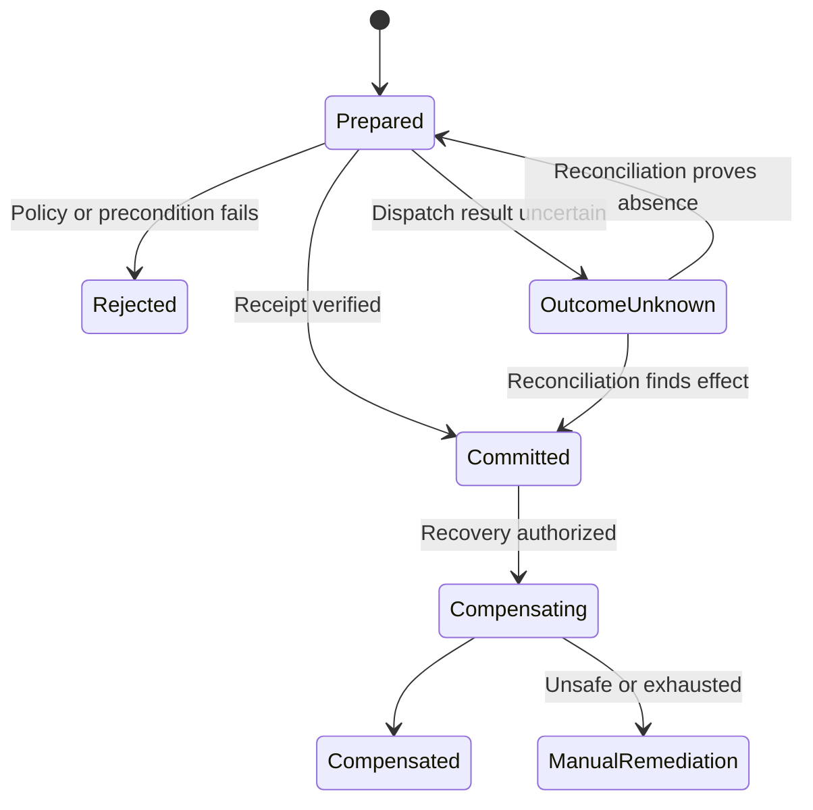

# Side-Effect and Compensation Protocol

Status: Implementation Ready  
Version: 1.0.0  
Work Package: `SECB-WP-ENGLOOP-003`

## Control rule

No warrant, no side effect. No receipt, no committed result. No proof of absence, no retry. Compensation is a new governed corrective action and never deletes the original history.

## Prepare–commit–reconcile

Every request conforms to `EFFECT_REQUEST.schema.json` and binds a stable effect ID, provider-scoped idempotency key, exact target, expected version, authority warrant, risk/data class, timeout, bounded retry, reconciliation query, receipt schema, registered compensation and evidence obligations.

A timeout after dispatch is `OUTCOME_UNKNOWN`, not failure. The gateway reconciles by idempotency key, provider receipt or expected resource version before any retry. Blind retries are prohibited.

## Compensation rules

- Verify current resource identity, ownership and expected version before action.
- Use reverse causal order for dependent effects.
- Parallelize only independent, non-overlapping resource scopes.
- Never rewrite protected Git history; use revert or forward correction.
- Shared production resources, data migrations and non-idempotent actions require a new warrant or ballot as policy dictates.
- Exhausted or unsafe compensation enters `MANUAL_REMEDIATION` and freezes dependent releases.

## Mandatory closure condition

Every prepared effect must finish as committed, rejected, proven absent, compensated or assigned to manual remediation. `OUTCOME_UNKNOWN` is never a terminal completion state.
