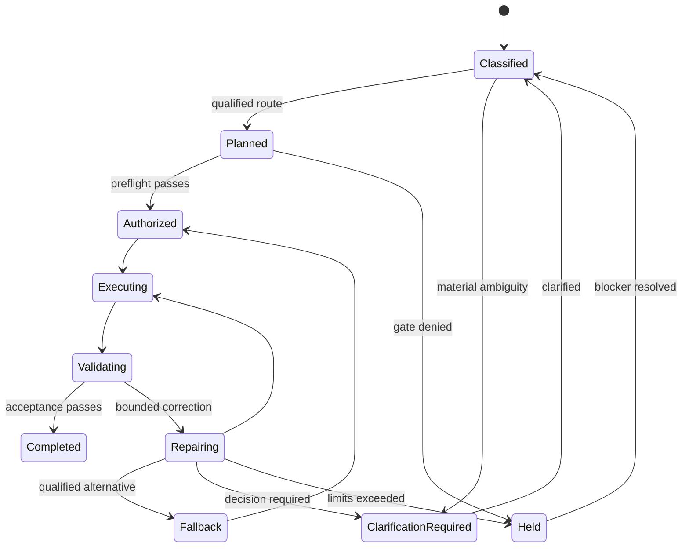

# Skill Router State Machine

Every transition binds actor identity, request and registry hashes, route version, preconditions, current authority, budget, expected state, idempotency key, event type, evidence references, failure state and timeout. A registry, policy, skill digest, request, destination or effect change invalidates unconsumed authorization and returns the route to classification or hold.
