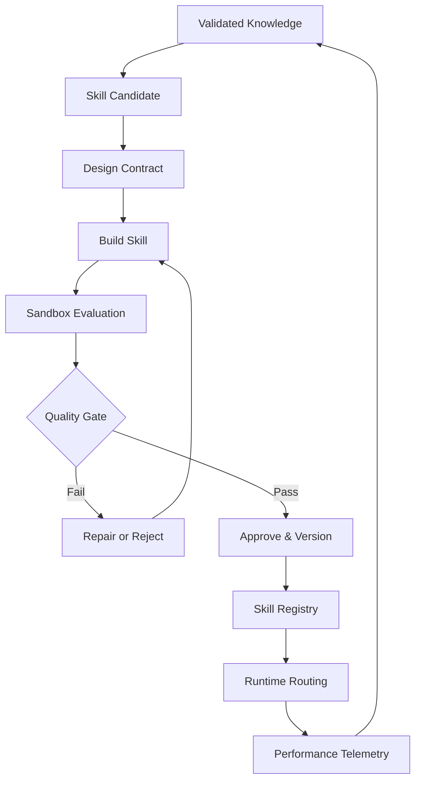

# Skill Factory — Convert Knowledge into Execution Capability

Status: Draft
Work Package: `SECB-WP-FWK-001`

## Purpose

Package validated knowledge as reusable instructions, workflows, or controlled automation.

## Skill Contract

Each skill must define:

- Name, ID, purpose, owner, and lifecycle state
- Trigger conditions and explicit non-triggers
- Inputs, outputs, and required context
- Preconditions and authority requirements
- Execution procedure and decision points
- Tools, permissions, data classification, and boundaries
- Validation and quality gates
- Stop, escalation, failure, and rollback behavior
- Test cases, adversarial cases, and evaluation benchmarks
- Version, provenance, compatibility, and change history

## Lifecycle

`Draft -> Tested -> Approved -> Active -> Deprecated -> Retired`

Only `Active` skills compatible with the current environment, authority, risk tier, and context may be routed at runtime.

## Promotion Gate

Promotion requires controlled evidence, independent validation, baseline comparison, policy-conflict checks, defined applicability, versioning, rollback, and human approval for high-impact capabilities.

