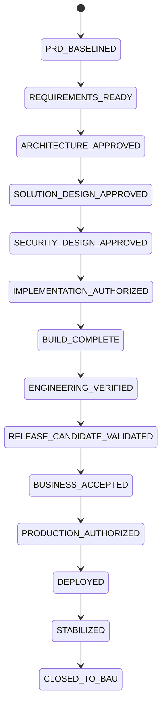

# Delivery Lifecycle — PRD to Production

Status: Adopted on merge of `SECB-WP-FWK-013` (issue #22)
Authority: Operator (vily); summary supplied 2026-08-10, deep definition the same day
Stage definitions: [`DELIVERY_LIFECYCLE_STAGES.md`](DELIVERY_LIFECYCLE_STAGES.md)
Scope: the delivery lifecycle for every product built on SecB. Stages 1–12 are
the **delivery lifecycle**; stages 1–14 are the **complete production
lifecycle**.

This document **maps onto** the ten gates of
[`CONTROL_GATES.md`](../00-governance/CONTROL_GATES.md) and the tiers of
[`RISK_AUTHORITY_MATRIX.md`](../00-governance/RISK_AUTHORITY_MATRIX.md). It
adds no new gate and no new tier. A stage is *where you are*; a control gate is
*what must be satisfied to leave*; the stage gate is *the recorded decision
that you left*.

## The governing principle

> **Evidence proves readiness, the gate records the decision, and
> authorization permits the next action.**

Evidence alone does not authorize deployment. The complete progression is
`Built → Verified → Validated → Business Accepted → Production Ready →
Explicitly Authorized → Deployed → Stabilized`, and

> **`BUILD_COMPLETE`, `SANDBOX_TESTED` and `BUSINESS_ACCEPTED` must never be
> read as production authorization.** Stages 9, 10 and 11 must each be passed
> first, and passing means exit criteria are evidenced, not asserted.

## Stage index

| # | Stage | Gate status | Control gate(s) | Tier |
|--:|---|---|---|---|
| 1 | PRD Review and Baseline | `PRD_BASELINED` | 1 Authority, 2 Readiness | R0–R1 |
| 2 | Requirement Decomposition | `REQUIREMENTS_READY` | 2 Readiness | R0–R1 |
| 3 | Architecture Design | `ARCHITECTURE_APPROVED` | 3 Architecture | R1–R2 |
| 4 | Detailed Solution Design | `SOLUTION_DESIGN_APPROVED` | 3 Architecture | R1–R2 |
| 5 | Security and Compliance Design | `SECURITY_DESIGN_APPROVED` | 6 Security *(design-time)* | R2–R3 |
| 6 | Implementation Planning | `IMPLEMENTATION_AUTHORIZED` | 1 Authority, 2 Readiness | R1 |
| 7 | Development | `BUILD_COMPLETE` | 4 Implementation | R1–R2 |
| 8 | Engineering Verification | `ENGINEERING_VERIFIED` | 5 Test | R1–R2 |
| 9 | Quality and Security Validation | `RELEASE_CANDIDATE_VALIDATED` | 6 Security *(validation-time)* | R2–R3 |
| 10 | UAT and Pilot | `BUSINESS_ACCEPTED` | 7 Evidence | R2–R3 |
| 11 | Production Readiness Review | `PRODUCTION_AUTHORIZED` | 8 Release *(readiness)* | R3 |
| 12 | Production Deployment | `DEPLOYED` | 8 Release *(authorization)* | **R4 — dual control** |
| 13 | Hypercare and Stabilization | `STABILIZED` | 7 Evidence *(post-deployment)* | R3–R4 |
| 14 | Post-Implementation Review | `CLOSED_TO_BAU` | 9 Learning, 10 Skill Promotion | R1–R2 |

Control gates 6 and 8 appear twice by design: design-time and validation-time
security are different passes, and release *readiness* is a different decision
from release *authorization*.

## State model

## Cross-stage governance

### 1. Requirements traceability

Every production capability carries a complete evidence chain:

`Business objective → PRD requirement → Detailed requirement → Design → Code
change → Test evidence → Release artifact → Production deployment`

**Any broken link is a traceability exception** and must be recorded as one,
not passed over.

### 2. Stage-gate decision model

Each gate returns exactly one controlled verdict:

| Verdict | Meaning |
|---|---|
| `APPROVED` | All mandatory conditions satisfied |
| `APPROVED_WITH_CONDITIONS` | Advancement allowed with owned, dated conditions |
| `REWORK_REQUIRED` | Deficiencies must be corrected before advancement |
| `BLOCKED` | External dependency or authority prevents progression |
| `REJECTED` | Proposal is not accepted |
| `HUMAN_REQUIRED` | Decision exceeds delegated agent authority |

> **Vocabulary reconciliation.** `HUMAN_REQUIRED` above is a *stage-gate*
> verdict. It is **not** the merge-authority vocabulary: `SECB-WP-FWK-012`
> retired `HUMAN_REQUIRED` from merge decisions in favour of
> `CONSTITUTIONAL_REQUIRED`, because a merge verdict must name the authority
> *level* rather than the approver's species. The two vocabularies are separate
> by design — a stage-gate verdict answers "may the project advance", a merge
> verdict answers "who may land this change" — and stage-gate `HUMAN_REQUIRED`
> corresponds to merge-level `CONSTITUTIONAL_REQUIRED`. If a single vocabulary
> across both layers is preferred, that is a one-line operator decision and a
> follow-up work package; it is flagged here rather than settled unilaterally.

### 2a. Specification conflicts

A gate can be blocked not by the work but by the specification contradicting
itself — an artifact consumed at one stage and created at another, an entry
condition disagreeing with an exit condition, one term carrying two meanings.
That class is handled deterministically by
[`SPECIFICATION_CONFLICT_PROTOCOL.md`](../00-governance/SPECIFICATION_CONFLICT_PROTOCOL.md):
record both statements verbatim, classify the conflict and its impact, take the
resolution that changes original intent least, and **separate continuing work
from amending the specification**.

An agent may neither reinterpret the specification silently nor stop for a human
on every occurrence. Where the decision formula is unmet the status is
`SPEC_OWNER_REQUIRED` — naming who must decide and what they are deciding.
The three verdict vocabularies (merge, stage gate, conflict) are reconciled in
that document and deliberately kept separate.

### 3. Evidence minimum

Every stage decision records: project and release identifier · stage and gate
identifier · artifact versions · evidence references · findings and
exceptions · risk assessment · conditions and owners · eligible approvers ·
votes or approval signatures · decision timestamp · effective status · expiry
or revalidation condition.

### 4. Change control

**A passed gate becomes invalid** when a material change affects approved
scope · critical requirements · architecture or trust boundaries · sensitive
data handling · security controls · regulatory obligations · deployment
topology · the release artifact · risk level · or production rollback
capability.

The project returns to the **earliest affected stage** for impact assessment
and reapproval. A gate is not a permanent possession.

### 5. Separation of duties (high-risk changes)

- The code author is not the only reviewer.
- The implementation agent does not approve its own evidence.
- Security validation is independent from development.
- Production authorization is separate from deployment execution.
- **A policy or gate change requires an authority independent of the policy
  being changed** — implemented mechanically by
  `scripts/check_dual_policy.py` (`SECB-WP-FWK-012`), which evaluates a change
  under both the incumbent and the proposed logic and escalates on divergence.

## Relationship to the Engineer Loop

[`ENGINEER_LOOP.md`](../06-agent-orchestration/ENGINEER_LOOP.md) describes the
*binding sequence* for one unit of authorized demand — request profile, route,
warrants, build, merge, release. This lifecycle describes the *product's
journey*. A product traverses stages 1–14 once per release; the Engineer Loop
runs many times inside stages 6–8, once per work package.

`ENGINEER_LOOP.md` reaching `FULL_LIFECYCLE_IMPLEMENTATION_READY` is a
statement about the *specification of the loop*, not about any product's
position on this map.

## Where SecB stands today (2026-08-12)

Recorded with citations so present position is a fact rather than an
impression.

> Updated 2026-08-12 (`SECB-WP-FWK-056`): stage 2 passed and stage 3 opened. **Two
> rows moved and nothing else did** — every statement below about stages 5, 6, 9
> and 12, and the traceability exception that follows this table, is unchanged by
> that verdict. A stage opening is the smallest event this table records; it is not
> progress toward production, and the rows that say production is unreachable still
> say it.

| Item | Position | Evidence |
|---|---|---|
| SecB framework | **Stage 1 PASSED (2nd pass)** — PRD v1.1.0 baselined; `APPROVED_WITH_CONDITIONS`, 7/7 criteria, obligation posture `OPEN_NON_BLOCKING` | `STAGE_GATE_PRD_BASELINED_V1_1.md`; `C-3`/`C-4` tracked in `CONDITION_REGISTER.md`, blocking stages 6 and 5 — neither blocks stage 2 or 3 |
| Stage 2 | **PASSED — `APPROVED_WITH_CONDITIONS`**. Verdict stated by the operator, `verdict_generated_at` 2026-08-12T16:36:07Z, **effective on the merge that carried this row**. 7/7 objectives, 7/7 criteria, obligation posture `OPEN_NON_BLOCKING` | `STAGE_GATE_REQUIREMENTS_READY.md`; composite form authorized by ballot 002; `SECB-WP-FWK-056` |
| Stage 3 | **admission `OPEN` · authority ceiling `ARCHITECTURE_APPROVED`** — five conjuncts hold; it opened because they hold, not because this row says so. **Admission and authorized action are separate quantities** and `OPEN` states only the first: stage 5 entry `DENIED` by `C-4`, stage 6 entry `DENIED` by `C-3`, `next_stage_auto_open = false` | Guard and ceiling in `STAGE_GATE_REQUIREMENTS_READY.md` §"Transition guard for stage 3" |
| Stages 3–5 for the router | Design documentation exists; no recorded gate verdicts | `ENGINEER_LOOP.md` v1.5.0, `SECURITY_THREAT_MODEL.md` — but no `ARCHITECTURE_APPROVED`, `SOLUTION_DESIGN_APPROVED` or `SECURITY_DESIGN_APPROVED` decision record exists |
| Stage 6 | **No `IMPLEMENTATION_AUTHORIZED` record** for the router; the FWK work packages authorize framework work only | issues #2–#22 |
| Stage 7–8, router MVP slice | Code plus verified tests, sandbox-certified | `SANDBOX_TESTED` under `REV-SECB-ENGLOOP-MVP-001-20260810` (`SECB-WP-FWK-009`, `663984a`); router v1.5.1 (`SECB-WP-FWK-010`, `de31bb3`) |
| Stages 9–11 | **Not begun; stage 9 is structurally BLOCKED** until a second identity exists — its independence requirement cannot be met by one party | `SINGLE_IDENTITY_SOD_ACCEPTED_RISK.md` (accepted for stages 1–8 only); `docs/15-runbooks/` is empty |
| Stage 12 | Production `NOT_AUTHORIZED` | `ENGINEER_LOOP.md` §7, unchanged by any merge to date |

### Traceability exception, recorded per §1

The router slice holds artifacts at stages 7–8 while stages 1–6 have **no
recorded gate verdicts**. Under §1 that is a broken chain, and under §4 the
correct response is to return to the earliest affected stage — stage 1 — and
establish the missing baselines before treating any downstream state as valid.

Stated plainly: **SecB has no product at `PRODUCTION_AUTHORIZED` and nothing
deployed.** Thirteen merged work packages built the governance and verification
machinery that stages 6–8 run on. That is real progress, and it is not the same
as being close to production. The lifecycle's first act is to say so about its
own repository.

## Instantiating this for a new product

Each product records its own stage position in a work package, citing the
artifact that establishes every state it claims. The lifecycle is referenced,
never copied per product, so a change to it applies everywhere at once.

A machine-readable stage state and a transition validator are deliberately
**not built yet**: no work package has been blocked without them. Build them
when one is (`AGENTS.md` Lean gate — the minimum that correctly solves the
task).
