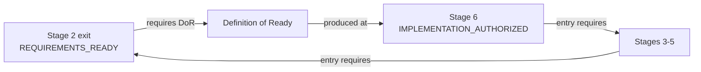

# Specification Conflict Record — `FWK-019`

Detected: 2026-08-10, at stage 2, while preparing the `REQUIREMENTS_READY` gate
Protocol: `docs/00-governance/SPECIFICATION_CONFLICT_PROTOCOL.md`
(installed by `SECB-WP-FWK-019-A`)
Recorded by: Claude (executor) · Resolved by: operator (vily), spec owner

## Source assertions — quoted verbatim, neither paraphrased

| Source | Statement |
|---|---|
| `DELIVERY_LIFECYCLE_STAGES.md` §2, exit gate | "priority-one stories meet the Definition of Ready" |
| `DELIVERY_LIFECYCLE_STAGES.md` §6, required artifacts | "Definition of Ready" listed among stage 6's artifacts |

Both are the operator's own specification text. Neither is wrong in isolation.

## Classification

```yaml
conflict:
  id: FWK-019
  title: Definition of Ready lifecycle conflict
  detected_at_stage: 2
  classification:
    types: [USE_BEFORE_DEFINITION, CIRCULAR_DEPENDENCY]   # SC-01, SC-08
    impact: C2_REVERSIBLE_BRIDGE
  impact_analysis:
    affected_gate: STAGE_2_EXIT
    blocked_downstream_stages: [3, 4, 5, 6]
    authority_change: false
    security_reduction: false
  provisional_resolution:
    action: CREATE_BOOTSTRAP_DOR
    artifact: Bootstrap Story DoR v0.1
    applies_to: priority-one requirements
    does_not_replace: Implementation DoR v1.0
    expires_when: canonical specification amendment becomes effective
  canonical_resolution:
    action: SPLIT_DOR_LIFECYCLE
    stage_2_artifact: Bootstrap Story DoR
    stage_6_artifact: Implementation DoR
    stage_6_requirement: Revalidate all implementation-bound work packages
    tracked_as: SECB-WP-FWK-019-A
  status: RESOLVED_BY_SPEC_OWNER
```

## The circularity, stated plainly



Stage 2 cannot pass without an artifact from stage 6; stage 6 cannot be entered
without stage 2 passing. Stages 3, 4, 5 and 6 are all blocked behind it.

## Why the resolution is a split rather than a choice

Neither available "choice" is correct. Moving the whole DoR to stage 2 would
require story-level readiness to include architecture, security, test data and
rollback readiness — none of which exist at stage 2. Relaxing stage 2's exit
condition would let unready requirements into architecture design, which is the
condition the gate exists to prevent.

The two stages need **different levels of readiness**, so one artifact cannot
serve both. That is what makes this a specification defect rather than a
judgement call.

## Decision formula, applied honestly

```text
PROCEED_WITH_PROVISIONAL_RESOLUTION =
    CONFLICT_RECORDED             ✔ this record
AND REVERSIBLE_SOLUTION           ✔ bridge has a stated closing condition
AND NO_AUTHORITY_EXPANSION        ✔ no path, tier, cap or verdict changes
AND NO_MANDATORY_CONTROL_REDUCTION ✔ adds a check; removes none
AND EVIDENCE_COMPLETE             ✔ four items below
AND BALLOT_QUORUM_MET             ✘ see below
AND CANONICAL_FIX_TRACKED         ✔ SECB-WP-FWK-019-A
```

**`BALLOT_QUORUM_MET` is false.** A `C2` bridge requires 4-of-5 role ballots
with Governance `APPROVE` and Security not `REJECT`. `ballot_layer.state` is
`NOT_ACTIVE` because five independent identities do not exist in this
deployment; one session emitting five role-labelled ballots would be
self-approval in five hats. The quorum is therefore not met and cannot be met
here.

Per the protocol, an unmet formula yields **`SPEC_OWNER_REQUIRED`**, not a
generic escalation and not a silent proceed.

**That verdict is satisfied.** The operator, who owns the specification, both
identified this conflict's resolution and instructed its adoption, in the
instruction of 2026-08-10 that specified the two-level DoR split. Status is
therefore `RESOLVED_BY_SPEC_OWNER` — a stronger footing than `PROVISIONALLY_RESOLVED`,
reached by stating the shortfall rather than by treating the formula as passed.

## Evidence pack

**1. Dependency graph** — above.

**2. Affected item list.** Priority-one requirements subject to the stage-2
gate, from `REQUIREMENT_CATALOGUE.md`: `FR-01` `FR-02` `FR-03` `FR-04` `FR-05`
`FR-06` `FR-07` `FR-08` `FR-09` `FR-10` `FR-11` `FR-12` `FR-18` — thirteen
items. Evaluation in `BOOTSTRAP_STORY_DOR.md`.

**3. Gate test.** The stage-2 exit condition is evaluated against the Bootstrap
DoR criteria per item, with results recorded and failures named. Twelve of
thirteen pass; `FR-12` fails criterion 3 and the failure is carried as a known
gap rather than waived.

**4. Traceability update.** `RTM.md` records the bridge and its closing
condition; `RAID_REGISTER.md` carries the conflict as issue `I-06`.

## What this record does not do

- It does not amend `DELIVERY_LIFECYCLE_STAGES.md`. That text still says what it
  said; the amendment is `SECB-WP-FWK-019-A` and it is a `C3` change requiring
  the spec owner's merge.
- It does not create the stage-6 Implementation DoR. Writing it now would be a
  second use-before-definition — stage 6 has not been entered.
- It does not lower any control. The bridge **adds** a check that did not exist.

## Closing condition

This bridge closes when `SECB-WP-FWK-019-A` is merged and the canonical stage
model names the Bootstrap Story DoR as a stage-2 artifact. At that point this
record becomes history rather than an operating instrument, and
`BOOTSTRAP_STORY_DOR.md` stops being a bridge and becomes the stage-2 artifact
it always described.
