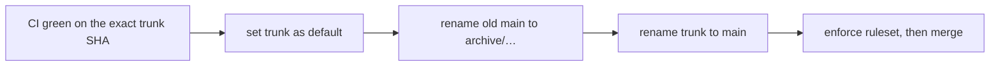

# Runbook — Canonical Branch Cutover, Without Rewriting History

Status: Adopted 2026-08-10 (`SECB-WP-FWK-033`) · **Never executed in this
repository** — `secb_pf` has one branch and `default_branch = main`, so there has
never been anything to cut over
Source: operator-supplied procedure for a sibling repository, generalized here
Audience: a project instantiated from SecB whose canonical branch is wrong

## When this applies

A project's `main` points at history that is no longer the truth: a migration
happened on a working branch, the real trunk is elsewhere, and `main` is stale.

**This is not a naming problem.** The default branch is the base for new PRs and
new commits, and `schedule` and some `workflow_dispatch` forms only run workflows
that exist on the default branch ([changing the default branch](https://docs.github.com/en/repositories/configuring-branches-and-merges-in-your-repository/managing-branches-in-your-repository/changing-the-default-branch),
[events that trigger workflows](https://docs.github.com/en/actions/reference/workflows-and-actions/events-that-trigger-workflows)).
A stale default silently produces PRs against the wrong base and scheduled runs of
the wrong workflows.

## The pattern: non-rewrite cutover



No force-push, no deleted commits, and **no artificial merge commit welding two
unrelated histories together**. The old history survives under an archive ref; the
new history becomes canonical by rename.

## Gate 1 — four proofs before touching anything

Freeze pushes, then prove all four. **Use full 40-character SHAs**; a short SHA in
a ceremony record is an invitation to ambiguity later.

| # | Proof | Command |
|--:|---|---|
| 1 | The archive ref points at the same commit as the old `main` | `git ls-remote <remote> refs/heads/main refs/heads/archive/<name>` |
| 2 | The claimed fix commit is an ancestor of the trunk tip | `git merge-base --is-ancestor <fix_sha> <remote>/<trunk>` |
| 3 | CI is green **on the trunk tip itself**, not merely on the fix commit | `gh api repos/<o>/<r>/commits/<trunk_tip>/check-runs` |
| 4 | The PR to be merged has the intended base and head | `gh pr view <n> --json baseRefName,headRefName,headRefOid,statusCheckRollup` |

And one negative check that is easy to skip and expensive to skip:

> **No open PR uses the trunk or the old `main` as its *head* branch.** Renaming a
> branch that is the head of an open PR **closes that PR**
> ([renaming a branch](https://docs.github.com/en/repositories/configuring-branches-and-merges-in-your-repository/managing-branches-in-your-repository/renaming-a-branch)).
> Base branches are re-pointed for you; head branches are not.

**Never infer that one SHA follows another from the order they appear in a
message.** Prove ancestry with a command, and record the values used.

## Gate 2 — change the default

Repository settings → default branch → point at the trunk. Then re-check that the
open PR still shows the intended base and an unchanged diff.

Requires repository admin, and organization admin where an organization or
enterprise ruleset applies.

## Gate 3 — rename, in this order

1. Old `main` → `archive/main-pre-migration-<date>-former-default`
2. Trunk → `main`

**The order is not cosmetic.** Renaming the trunk to `main` first would collide
with the existing `main`; changing the default first means the rename never leaves
the repository without a default.

GitHub redirects the old URLs, moves branch-protection policies, and re-points the
base of open PRs. It does **not** update:

- `on.push.branches` filters in workflows
- reusable-workflow references pinned to the old branch name
- deployment scripts and CI config outside `.github/`
- README badges and raw `githubusercontent` URLs
- **external consumers** referencing your action or workflow `@old-branch-name`

Sweep for the old name across the repository and fix each. The last item cannot be
fixed from inside the repository — it needs an announcement.

## Gate 4 — protect the canonical branch

Target the ruleset at the **default branch** (`~DEFAULT_BRANCH`) rather than a
branch name, so a future rename cannot silently un-protect it
([creating rulesets](https://docs.github.com/en/repositories/configuring-branches-and-merges-in-your-repository/managing-rulesets/creating-rulesets-for-a-repository)).

Minimum: require a pull request · require each enforcement gate as a status check ·
require the branch up to date or a merge queue · **block force pushes** · restrict
deletion · apply to administrators, or restrict bypass to the ratification
authority alone · lock archive branches read-only.

GitHub's own warning is the reason force-push is blocked by default: it can remove
commits that others have referenced from a branch's history, and it affects open
PRs ([about protected branches](https://docs.github.com/en/repositories/configuring-branches-and-merges-in-your-repository/managing-protected-branches/about-protected-branches)).

> **Not available on every plan.** In `secb_pf` this gate cannot be satisfied at
> all: `rulesets` and `branches/main/protection` both return
> `403 Upgrade to GitHub Pro or make this repository public`. A project on that
> footing must record Gate 4 as **unverifiable** rather than passed — see
> `GENESIS_RATIFICATION_AUDIT.md` for how that is recorded honestly.

## Gate 5 — ratify

Merge only when every prior gate holds, then record, in the ratification record:
the PR number · `source_head_sha` · `result_sha` · **the shared tree hash if the
merge was a squash** · the gate-run URLs · the ratifying actor and timestamp.

The tree hash matters because a squash merge does not make the tested head an
ancestor of `main`, so the ancestry proof is unavailable afterwards and the
content proof is all that remains. Full reasoning and a worked example:
`GENESIS_RATIFICATION_AUDIT.md`.

## If a force-push is genuinely unavoidable

It is a fallback, and it costs more governance than the cutover it replaces.

**Never:**

```bash
git push <remote> +<sha>:refs/heads/main
```

A raw `+` refspec has no concurrency protection: it overwrites whatever is there,
including work pushed in the seconds since you checked.

**Instead, with an explicit lease:**

```bash
git push <remote> \
  --force-with-lease=refs/heads/main:<FULL_OLD_MAIN_SHA> \
  <FULL_TESTED_SHA>:refs/heads/main
```

The explicit `<ref>:<expected-sha>` form refuses the write if the remote has moved
from the SHA you authorized ([git push](https://git-scm.com/docs/git-push)).

This path additionally requires: a separate ballot, a maintenance freeze, an
archive digest taken **before** the write, an authorized bypass record, and
post-operation verification. **Prefer the non-rewrite cutover** — its whole
advantage is that none of that is needed.

## Applicability to `secb_pf` itself

**None today, and recorded so rather than left implied.** One branch,
`default_branch = main`, nothing stale, no rewrite ever performed. The runbook is
here for projects instantiated from SecB, and because the `G-01`…`G-10` gate set it
comes with turned out to be worth applying retroactively to SecB's own Genesis —
where it found that `G-02` is false as written under a squash-merge convention.
