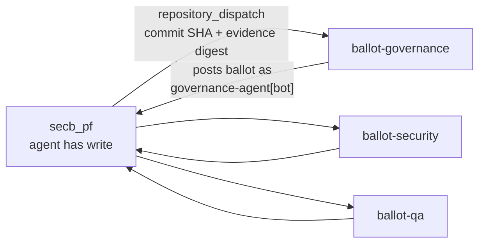

# Analysis — The Autonomy Ceiling

Status: Analysis complete · one path identified · **no change made**
Work Package: `SECB-WP-FWK-024` (issue #44)
Occasion: the operator's clarification of 2026-08-10 — SecB is *autonomous
governance in every dimension, minimising human involvement*, with the Agentic
Engineer Team running the Enterprise Delivery Lifecycle itself

## 1. How autonomous is the team already

Measured from git history and the recorded verdicts, not estimated.

| Period | Merged PRs | Autonomous | Escalated |
|---|--:|--:|--:|
| Whole repository | 20 | 8 | 12 |
| **Since the Genesis Ratification** (`035b66d`) | **11** | **8** | **3** |

The whole-repository figure (40%) is misleading: before Genesis no delegation
existed, so every merge was necessarily human. **The operative number is 73%.**

### The three escalations, individually

| Merge | Verdict that escalated it | Root cause |
|---|---|---|
| `19b5461` lifecycle deep definition | `AGENT_BALLOT_REQUIRED` — 766 lines over the 600 envelope cap | Cap; also ballot layer inactive |
| `06ed153` stage-1 verdict record | `AGENT_BALLOT_REQUIRED` — governance path | **Ballot layer `NOT_ACTIVE`** |
| `32252f3` conflict protocol + canonical amendment | `AGENT_BALLOT_REQUIRED` — governance path, `C3` gate semantics | **Ballot layer `NOT_ACTIVE`** |

Two of three, and the recurring one, have a single cause. The cap breach is
self-inflicted and avoidable by splitting a work package.

## 2. Four walls, one root cause

Everything currently blocking further autonomy reduces to the absence of
**independent agent identities**.

| Wall | Consequence today | Removed by independent identities? |
|---|---|---|
| `ballot_layer.state = NOT_ACTIVE` | `AGENT_BALLOT_REQUIRED` is *unsatisfiable*, so every `G1`/`G2` governance change reaches the operator | **Yes** — quorum becomes attainable |
| Ladder tiers `A3`/`A4` unreachable | Governance implementation and envelope adjustment can never be delegated, whatever the evidence | **Yes** — the envelope gates them on an active ballot layer |
| Stage 9 structurally blocked | QA and Security must approve *independently*; production is unreachable, so stages 10–12 are dead ends | **Yes** — independence is the whole requirement |
| SoD nominal at stages 3, 5, 10, 11 | Five named review bodies have no members; accepted as a risk for stages 1–8 only | **Partly** — real for agent-decidable gates, still nominal where a business judgement is required |

**One change unblocks four walls.** No other single change in the register comes
close; the external trust anchor (`D1`) is important but removes none of these on
its own.

## 3. What "independent identity" has to mean

The failure mode to avoid is precise, and it is the one this repository has
already reasoned about twice: **a role label is text the labelling party writes
about itself.** Five ballots emitted by one process with five banners is
self-approval in five hats, and giving that process five credentials changes
nothing — it still holds all five.

So independence is **an execution-isolation property, not a credential
property**. The test is: *can the party proposing a change obtain the ballot of
another role by any means available to it?* If yes, there is one identity wearing
costumes.

Two things must therefore hold:

1. **A structural actor field**, not body text — the identity recorded by the
   platform, not asserted in a comment.
2. **Credential unreachability** — the proposing process must be unable to read
   or invoke the approving role's credential.

## 4. Research — what is available on this account

Verified against `bstBizEra`, a personal account with no organisation.

### GitHub Apps give the structural actor field, and do not need an organisation

A GitHub App acts on its own behalf with its own identity rather than through a
service account, and its commits and API actions carry a distinct
`<app-slug>[bot]` actor that `github.actor` matches
([GitHub Apps as service-account replacement](https://josh-ops.com/posts/github-apps/),
[create-github-app-token](https://github.com/actions/create-github-app-token)).
Practitioners are already using exactly this to give each AI agent its own commit
signature ([per-agent bot identity](https://dev.to/agent_paaru/each-ai-agent-gets-its-own-github-identity-how-we-gave-every-bot-its-own-bot-commit-signature-1197),
[agent identity for git commits](https://justin.poehnelt.com/posts/agent-identity-git-commits/)).

**This closes requirement 1 with no organisation and no paid plan.**

### Credential unreachability is where the plan bites

The obvious mechanism — Actions **environments** with per-environment secrets, so
a job can only read its own role's key — does not work here:

> *"If you are using GitHub Free, environment secrets are only available in public
> repositories."* And deployment protection rules such as required reviewers are,
> on Free, Pro **and** Team, *"only available for public repositories"*
> ([Deployments and environments](https://docs.github.com/en/actions/reference/workflows-and-actions/deployments-and-environments),
> [Secrets](https://docs.github.com/en/actions/concepts/security/secrets)).

`secb_pf` is **private on Free**. So environment-scoped secrets and required
reviewers are both unavailable — consistent with the `403` already recorded for
rulesets and branch protection. Repository secrets exist, but every job in the
repository can read them, which is no isolation at all.

## 5. A design that works on this account

**One repository per ballot role.** Repository secrets are scoped to their
repository, and that scoping *is* available on Free.

- Each ballot repository holds **only its own App private key**, as its own
  repository secret.
- The proposing agent has **no write access** to the ballot repositories, so it
  cannot alter the deciding logic or read the keys. It can only *request* a ballot
  by dispatch, carrying the exact commit SHA and evidence digest.
- Each ballot workflow posts its verdict back as its own `[bot]` identity — the
  structural actor field.

This satisfies both requirements without an organisation, without a paid plan,
and without branch protection.

### Residual weaknesses, stated

- **Correlated reasoning.** Five repositories running the same model with the same
  prompt produce five copies of one judgement. That is redundancy, not
  independence — the operator's own standard already recommends a *model-diverse*
  council, and this design should use different models or materially different
  role prompts.
- **The operator holds the keys.** Whoever can add a secret to a ballot repository
  can impersonate that role. That is unavoidable and it is the trust anchor, not a
  defect.
- **The dispatch payload is agent-supplied.** A ballot repository must verify the
  commit SHA and evidence digest against the API itself rather than trusting the
  payload, or the proposer chooses what gets judged.
- **Still no external verifier.** `D1` remains open: the governance check runs
  inside the repository it judges, mitigated only by `G4` on `.github/`.

## 6. The floor — what cannot be delegated

*"Minimise human involvement"* has a floor, and naming it is the difference
between an autonomous system and a decorative one.

| Layer | Delegable? |
|---|---|
| `L3` operational | **Yes** — already delegated; this is most of the 73% |
| `L2` policy implementation | **Yes, once the ballot layer is active** — this is the 27% |
| `L1` envelope, within `L0` ceilings | **Yes at tier `A4`**, which the ladder pre-authorises |
| **`L0` constitution, absolute ceilings, quorum, trust anchor** | **No.** If an agent can amend these, every control below is advisory and the structure is theatre |

The floor is not a limitation of this design; it is what makes the delegation
above it mean anything. `L0` itself already anticipates the holder need not be a
single person — *"a steering committee, a threshold-signature council, or an
external body"* — so the floor is **a human-rooted authority, not necessarily a
human in the loop of each decision.**

Realistic target: `L3` and `L2` fully autonomous, `L1` autonomous at `A4`, and the
human acting **only** on constitutional change and as the key-holding trust
anchor. On this session's evidence that would move 73% to approximately 100% of
non-constitutional merges, with the human's remaining work being the two gate
verdicts and the occasional `L0` amendment.

## 7. Change-control flag — raised, not decided

The PRD's six objectives do not include minimising human involvement. Its
change-control block says any change to scope, success metrics or acceptance
criteria requires a new version and a fresh pass of stage 1.

Reading the clarification as a **new objective `O7`** would make this a §4
change-control event: re-baseline the PRD, re-pass stage 1, and add requirements
and a KPI for autonomy rate — which is now measurable at 73%.

Reading it as a **restatement of existing intent** would not: the PRD already
describes a governed autonomous execution system, and objective 1 covers
mechanising gates.

**Recommendation: treat it as `O7` and re-baseline.** The measurement makes it a
real objective with a real number, and a purpose the product is steered by should
be in the document that defines the product. Per the Specification Conflict
Protocol, this is raised for the spec owner rather than absorbed by the executor.

## 8. What this analysis does not do

It changes no code, no configuration and no policy. Creating ballot repositories
and installing Apps touches `.github/` and creates new repositories — `G4`, and
the operator's decision. The recommendation is a path, not an action taken.
